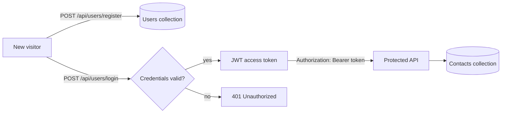
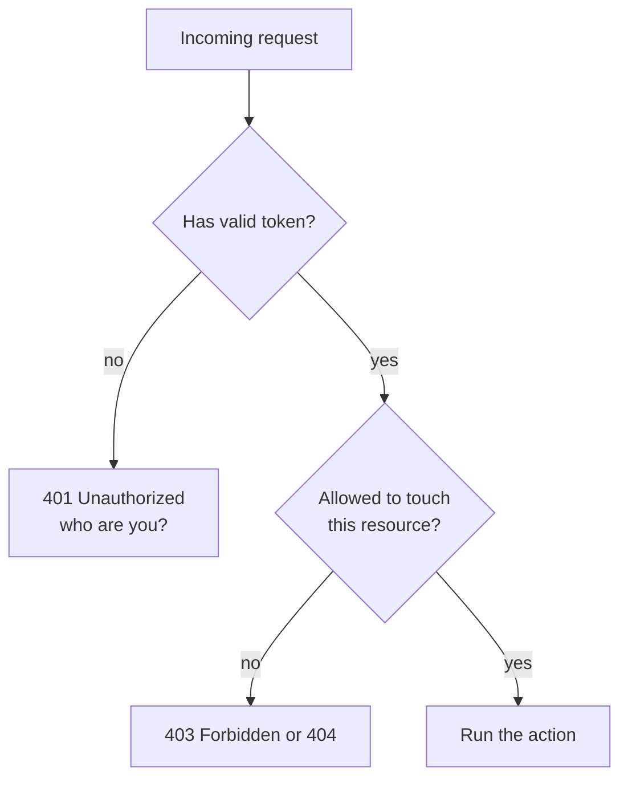
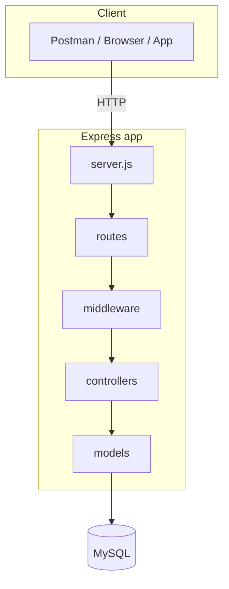
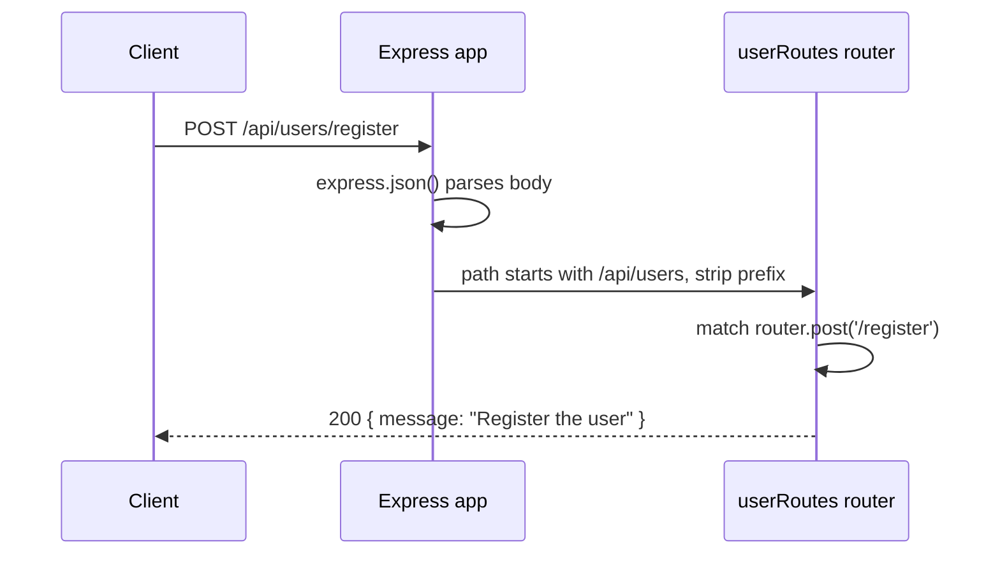
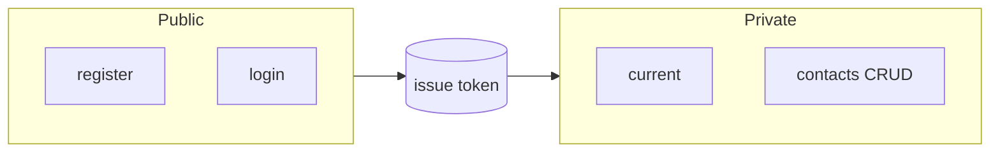

# 01 — Adding User Routes: Registration, Login & Current

> **Goal:** Understand what authentication is, design the three user endpoints
> (`register`, `login`, `current`), create the route file, and wire it into the server.
> This lesson sets up the whole project that the next 13 lessons build on.

---

## 1. Where We Are Going

In the Express course you built a Posts API where **anyone** could create, edit and
delete anything. Real applications need to know **who** is calling.

In this course we build a **Contacts API with login**:

- A person **registers** an account.
- They **log in** and receive a **JWT access token**.
- They send that token with every request.
- They can only see and change **their own** contacts.



---

## 2. Prerequisite Concept: Authentication vs Authorization

These two words are often mixed up. They are different questions.

| | **Authentication (AuthN)** | **Authorization (AuthZ)** |
|---|----------------------------|---------------------------|
| Question | *Who are you?* | *What are you allowed to do?* |
| Example | Checking email + password | Checking you own this contact |
| Happens | First | After authentication |
| Failure status | **401 Unauthorized** | **403 Forbidden** (or 404) |
| In this course | Lessons 4–8 | Lessons 9–14 |

Real-life analogy — **a hotel**:

1. At reception you show your ID and get a **key card** → *authentication*.
2. The key card opens **only your room**, not every room → *authorization*.

The JWT is the key card.



---

## 3. Prerequisite Concept: HTTP Is Stateless

HTTP has **no memory**. Each request is independent; the server does not remember that
you logged in a second ago.

```
Request 1: POST /login      → "ok, welcome"
Request 2: GET  /contacts   → "who are you?"   (server forgot)
```

So after login the client must **prove its identity on every request**. Two classic ways:

| Approach | What the client sends each time | Where the state lives |
|----------|---------------------------------|-----------------------|
| **Session + cookie** | A session id cookie | Server memory / DB |
| **Token (JWT)** | A signed token (header) | Inside the token itself |

We use **JWT tokens**. Lesson 5 explains them fully.

---

## 4. Designing the User Endpoints

We need exactly three endpoints.

| Method | URL | Access | Purpose |
|--------|-----|--------|---------|
| `POST` | `/api/users/register` | **Public** | Create a new account |
| `POST` | `/api/users/login` | **Public** | Check credentials, return a token |
| `GET`  | `/api/users/current` | **Private** | Return info about the logged-in user |

### Why these methods?

- **Register = POST**: it *creates* a user (REST rule from lesson 20 of the Express course).
- **Login = POST**: credentials must travel in the **body**. If you used `GET`, the
  password would appear in the URL → saved in browser history, server logs, proxies.
- **Current = GET**: it only *reads* data; it is safe and repeatable.

> 🔐 **Never** send passwords in a URL or query string. Always POST over **HTTPS**.

### Why `/api/users/...`?
`/api` separates data routes from pages, `/users` is the resource, and
`register/login/current` are the actions. (Strict REST purists would use
`POST /api/users` and `POST /api/sessions`; the "action in URL" style is more common
in tutorials and perfectly fine for learning.)

---

## 5. Project Setup

Create a new project (separate from the Posts project):

```bash
mkdir mycontacts-backend
cd mycontacts-backend
npm init -y
npm install express
npm install -D nodemon        # optional; Node 20 also has --watch
git init
```

Edit `package.json`:

```json
{
  "name": "mycontacts-backend",
  "version": "1.0.0",
  "type": "module",
  "main": "server.js",
  "scripts": {
    "start": "node server.js",
    "dev": "node --watch --env-file=.env server.js"
  },
  "dependencies": {
    "express": "^5.1.0"
  }
}
```

- `"type": "module"` → we use `import/export` (Express course lesson 18).
- `--env-file=.env` → loads environment variables (Express course lesson 12).

Create `.gitignore`:

```
node_modules
.env
```

Create `.env`:

```
PORT=5000
```

Packages we will add in later lessons:

| Lesson | Package | Why |
|--------|---------|-----|
| 3 | `mysql2` | Connect to MySQL with a promise-based pool |
| 4 | `bcrypt` | Hash passwords |
| 6 | `jsonwebtoken` | Create/verify JWTs |

---

## 6. Folder Structure We Will End With

```
mycontacts-backend/
├── server.js
├── .env
├── .gitignore
├── package.json
├── config/
│   └── dbConnection.js        (lesson 3)
├── models/
│   ├── userModel.js           (lesson 3)
│   └── contactModel.js        (lesson 9)
├── controllers/
│   ├── userController.js      (lessons 2, 4, 6, 7)
│   └── contactController.js   (lessons 11–14)
├── routes/
│   ├── userRoutes.js          (this lesson)
│   └── contactRoutes.js       (lesson 10)
├── middleware/
│   ├── errorHandler.js        (lesson 2)
│   └── validateTokenHandler.js (lesson 8)
└── utils/
    └── HttpError.js           (lesson 2)
```



Same layering as lesson 27 of the Express course: **routes → controllers → models**.

---

## 7. Step 1 — A Minimal `server.js`

```js
import express from 'express';

const app = express();
const PORT = process.env.PORT || 5000;

app.use(express.json());      // parse JSON request bodies (needed for register/login)

app.get('/', (req, res) => {
  res.json({ message: 'MyContacts API is running' });
});

app.listen(PORT, () => {
  console.log(`Server running on port ${PORT}`);
});
```

Run `npm run dev` and open `http://localhost:5000`. You should see the JSON message.

`express.json()` is essential: without it `req.body` is `undefined` and registration
would fail (Express course lesson 19).

---

## 8. Step 2 — Create the Route File

`routes/userRoutes.js`:

```js
import express from 'express';

const router = express.Router();

// @desc    Register a user
// @route   POST /api/users/register
// @access  Public
router.post('/register', (req, res) => {
  res.json({ message: 'Register the user' });
});

// @desc    Login a user
// @route   POST /api/users/login
// @access  Public
router.post('/login', (req, res) => {
  res.json({ message: 'Login the user' });
});

// @desc    Current user info
// @route   GET /api/users/current
// @access  Private
router.get('/current', (req, res) => {
  res.json({ message: 'Current user information' });
});

export default router;
```

### The `@desc / @route / @access` comment block
A widely used documentation habit:

| Tag | Meaning |
|-----|---------|
| `@desc` | What the endpoint does |
| `@route` | Method and full URL |
| `@access` | `Public` (anyone) or `Private` (token required) |

When the project grows you can see the security level of every endpoint at a glance —
very useful in a **security review**.

---

## 9. Step 3 — Mount the Router

In `server.js`:

```js
import express from 'express';
import userRoutes from './routes/userRoutes.js';

const app = express();
const PORT = process.env.PORT || 5000;

app.use(express.json());

app.use('/api/users', userRoutes);      // every route in the file gets this prefix

app.listen(PORT, () => console.log(`Server running on port ${PORT}`));
```

How the URL is built:

```
app.use('/api/users', userRoutes)   +   router.post('/register')
        └── prefix ──┘                       └── path ──┘
                   =  POST /api/users/register
```



---

## 10. Step 4 — Test All Three Endpoints

### Postman
| Request | URL | Expected body |
|---------|-----|---------------|
| POST | `http://localhost:5000/api/users/register` | `{"message":"Register the user"}` |
| POST | `http://localhost:5000/api/users/login` | `{"message":"Login the user"}` |
| GET | `http://localhost:5000/api/users/current` | `{"message":"Current user information"}` |

### curl
```bash
curl -i -X POST http://localhost:5000/api/users/register
curl -i -X POST http://localhost:5000/api/users/login
curl -i http://localhost:5000/api/users/current
```

Right now `/current` is open to everyone — **not secure yet**. Lessons 7–8 fix that.

Create a Postman **environment** `Local` with `baseUrl = http://localhost:5000` and use
`{{baseUrl}}/api/users/register` (Express course lesson 11).

---

## 11. Public vs Private Routes

Plan access levels now; it drives every later decision.

| Route | Access | Needs token? |
|-------|--------|--------------|
| `POST /api/users/register` | Public | No |
| `POST /api/users/login` | Public | No |
| `GET /api/users/current` | Private | **Yes** |
| `GET /api/contacts` | Private | **Yes** |
| `POST /api/contacts` | Private | **Yes** |
| `GET /api/contacts/:id` | Private | **Yes** |
| `PUT /api/contacts/:id` | Private | **Yes** |
| `DELETE /api/contacts/:id` | Private | **Yes** |



Rule of thumb: **everything is private unless there is a reason for it to be public.**

---

## 12. Security Thinking From Day One 🔐

| Topic | Decision |
|-------|----------|
| Transport | Use **HTTPS** in production; passwords/tokens in plain HTTP can be sniffed |
| Credentials location | Request **body**, never URL |
| Account enumeration | Login errors must not reveal whether the email exists (lesson 6) |
| Brute force | Add rate limiting on `login` and `register` (later) |
| Logging | Never log passwords or tokens |
| CORS | Allow only your own front-end origins |
| Headers | Use `helmet` (Express course lesson 23) |
| Secrets | In `.env`, never in Git |

---

## 13. Common Mistakes

| Mistake | Symptom | Fix |
|---------|---------|-----|
| Forgetting `export default router` | `does not provide an export named 'default'` | Add it |
| Missing `.js` in the import path | `ERR_MODULE_NOT_FOUND` | `./routes/userRoutes.js` |
| `app.use(userRoutes)` without a prefix | Routes are `/register`, not `/api/users/register` | `app.use('/api/users', userRoutes)` |
| Router mounted **before** `express.json()` | `req.body` undefined | Parser first |
| Using `GET` for login | Credentials in URL | `POST` |
| Using `router.get` for register | `Cannot POST /api/users/register` | Match the method |
| `.env` not loaded | `PORT` undefined | `--env-file=.env` or `dotenv` |
| Wrong Postman method | 404 | Check method + URL |

---

## 14. Exercises

1. Create the project, install Express and run the basic server.
2. Add `userRoutes.js` with three routes and mount it at `/api/users`.
3. Test all three endpoints in Postman and with curl.
4. Add the `@desc/@route/@access` comments to each route.
5. Change the prefix to `/api/v1/users` and observe the new URLs.
6. Send a `GET` to `/register` and read the 404 message. Why does it happen?
7. Draw (on paper) the request flow for `POST /api/users/login`.
8. Write down which routes you think must be private and why.

### Challenge
Add a fourth route `POST /api/users/logout` placeholder. Think: with **stateless JWT**,
what does "logout" actually mean on the server? (Hint: see lesson 5, "revocation".)

---

## 15. Quick Quiz

1. What is the difference between authentication and authorization?
2. Which status code means "not authenticated"?
3. Why is login a POST and not a GET?
4. What does `@access Private` mean in our comments?
5. What happens if `express.json()` is registered after the router?
6. Why is HTTP called stateless?

<details><summary>Answers</summary>

1. AuthN = who you are; AuthZ = what you may do.
2. 401.
3. Credentials must not appear in URLs (logs, history); POST puts them in the body.
4. The endpoint requires a valid token.
5. `req.body` is undefined in the router handlers.
6. The server keeps no memory between requests; each must carry its own proof.
</details>

---

## 16. Summary

- Authentication = proving identity; authorization = checking permissions.
- HTTP is stateless, so the client sends a **token** on every protected request.
- We created three user routes: `register` (public), `login` (public), `current`
  (private), mounted under `/api/users`.
- Project structure follows routes → controllers → models.
- Security starts at design time: POST for credentials, HTTPS, secrets in `.env`.

---

## 17. Next Lesson

➡️ **02 — Adding User Controller**
Move the route logic into a controller, add a central error handler, and validate input.
