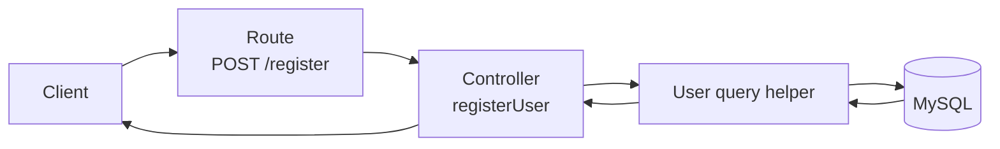
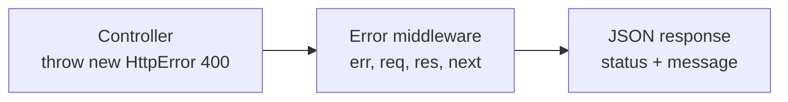
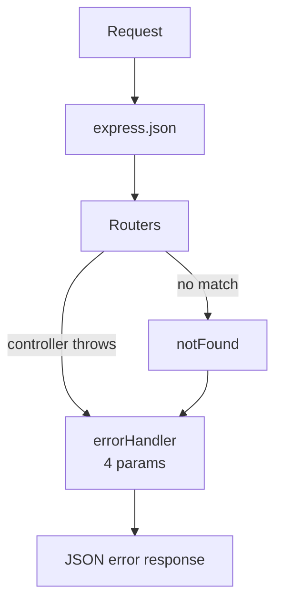

# 02 — Adding User Controller

> **Goal:** Move the logic out of the route file into a **controller**, add a central
> **error handler** with a reusable `HttpError`, and validate incoming data before we
> touch the database.

---

## 1. Why Controllers?

Right now each route handler is an inline arrow function inside `userRoutes.js`.
That works for placeholders, but soon each handler will contain 20–40 lines
(validation, database calls, hashing, token creation).

If everything lives in the route file:

- the routes stop being readable,
- logic cannot be reused or tested,
- putting database queries in routes makes changing storage later require editing every
  route.

**Separation of concerns** (Express course lesson 27):

| Layer | Job | File |
|-------|-----|------|
| Route | "This URL + method calls that function" | `routes/userRoutes.js` |
| Controller | Read request, apply logic, send response | `controllers/userController.js` |
| Model | Talk to the database | `models/userModel.js` |



---

## 2. Step 1 — Create the Controller

`controllers/userController.js`:

```js
// @desc    Register a user
// @route   POST /api/users/register
// @access  Public
export const registerUser = async (req, res) => {
  res.json({ message: 'Register the user' });
};

// @desc    Login a user
// @route   POST /api/users/login
// @access  Public
export const loginUser = async (req, res) => {
  res.json({ message: 'Login the user' });
};

// @desc    Current user info
// @route   GET /api/users/current
// @access  Private
export const currentUser = async (req, res) => {
  res.json({ message: 'Current user information' });
};
```

### Why `async`?
Database queries, bcrypt hashing and JWT work are **asynchronous**. Declaring handlers
`async` now lets us use `await` later without changing signatures.

### Named exports
`export const registerUser = ...` → imported with braces
(`import { registerUser } from ...`). See Express course lesson 18.

---

## 3. Step 2 — Slim the Route File

`routes/userRoutes.js`:

```js
import express from 'express';
import { registerUser, loginUser, currentUser } from '../controllers/userController.js';

const router = express.Router();

router.post('/register', registerUser);
router.post('/login', loginUser);
router.get('/current', currentUser);

export default router;
```

**Pass the function, do not call it:**

```js
router.post('/register', registerUser);     // ✅ Express calls it later
router.post('/register', registerUser());   // ❌ runs immediately, passes undefined
```

Test again — responses must be identical to lesson 1. A refactor changes the *structure*,
not the *behavior*.

---

## 4. Prerequisite Concept: Error Handling in an Async API

Controllers will fail in many ways: missing fields, duplicates, database errors, bad
tokens. We need **one place** that turns errors into consistent JSON responses.

### Express 5 and async errors

| Express version | `throw` inside `async` handler |
|-----------------|--------------------------------|
| **5** (this course) | Automatically forwarded to the error handler ✅ |
| **4** | Not forwarded → request hangs. Needs `try/catch` + `next(err)` or `express-async-handler` |



If you use Express 4, install `express-async-handler` and wrap each controller:

```js
import asyncHandler from 'express-async-handler';
export const registerUser = asyncHandler(async (req, res) => { ... });
```

Everything else in this course stays identical.

---

## 5. Step 3 — A Reusable `HttpError`

`utils/HttpError.js`:

```js
export class HttpError extends Error {
  constructor(status, message, details) {
    super(message);
    this.name = 'HttpError';
    this.status = status;
    this.details = details;       // optional (validation details)
  }
}
```

Usage inside any controller:

```js
throw new HttpError(400, 'All fields are mandatory');
```

An error is just an object carrying a `status` the handler can read.

---

## 6. Step 4 — The Central Error Handler

`middleware/errorHandler.js`:

```js
export const errorHandler = (err, req, res, next) => {
  if (res.headersSent) return next(err);

  const status = err.status || 500;
  const isProd = process.env.NODE_ENV === 'production';

  if (status >= 500) console.error(err);       // log server bugs for developers

  res.status(status).json({
    status,
    message: status >= 500 && isProd ? 'Internal Server Error' : err.message,
    ...(err.details && { details: err.details }),
    ...(!isProd && status >= 500 && { stack: err.stack }),
  });
};
```

And a 404 for unknown routes `middleware/notFound.js`:

```js
import { HttpError } from '../utils/HttpError.js';

export const notFound = (req, res, next) => {
  next(new HttpError(404, `Route not found: ${req.method} ${req.originalUrl}`));
};
```

Register them **last** in `server.js`:

```js
import { notFound } from './middleware/notFound.js';
import { errorHandler } from './middleware/errorHandler.js';

app.use('/api/users', userRoutes);

app.use(notFound);
app.use(errorHandler);
```

Order matters: routes → `notFound` → `errorHandler`.



---

## 7. Step 5 — Input Validation in the Controller

**Never trust the client.** Validate before using data.

### Registration needs: `username`, `email`, `password`

```js
import { HttpError } from '../utils/HttpError.js';

export const registerUser = async (req, res) => {
  const { username, email, password } = req.body ?? {};

  if (!username || !email || !password) {
    throw new HttpError(400, 'All fields are mandatory');
  }

  res.json({ message: 'Register the user' });
};
```

`req.body ?? {}` protects against `req.body` being `undefined` (no JSON sent), which
would otherwise crash with `Cannot destructure property`.

### Stricter validation (recommended)

```js
const isString = (v) => typeof v === 'string';
const EMAIL_RE = /^[^\s@]+@[^\s@]+\.[^\s@]+$/;

export const registerUser = async (req, res) => {
  const { username, email, password } = req.body ?? {};

  if (![username, email, password].every(isString)) {
    throw new HttpError(400, 'username, email and password must be strings');
  }
  if (username.trim().length < 3 || username.length > 50) {
    throw new HttpError(400, 'username must be 3–50 characters');
  }
  if (!EMAIL_RE.test(email) || email.length > 254) {
    throw new HttpError(400, 'A valid email is required');
  }
  if (password.length < 8 || password.length > 72) {
    throw new HttpError(400, 'password must be 8–72 characters');
  }

  res.json({ message: 'Register the user' });
};
```

### Why `typeof === 'string'` matters (SQL input validation preview) 🔐

An attacker can send objects or arrays instead of strings:

```json
{ "email": ["not", "a", "string"], "password": 123 }
```

Rejecting unexpected types gives clear validation errors. In MySQL, the core defense
against SQL injection is parameterized queries (lesson 3); never concatenate request
values into SQL text.

### Why max 72 for passwords?
bcrypt only uses the first **72 bytes** of the password (lesson 4). Limiting length also
prevents huge-payload CPU abuse.

---

## 8. Login and Current Validation

```js
export const loginUser = async (req, res) => {
  const { email, password } = req.body ?? {};

  if (typeof email !== 'string' || typeof password !== 'string' || !email || !password) {
    throw new HttpError(400, 'All fields are mandatory');
  }

  res.json({ message: 'Login the user' });
};

export const currentUser = async (req, res) => {
  res.json({ message: 'Current user information' });
};
```

Status code guide for this project:

| Situation | Status |
|-----------|--------|
| Missing/invalid input | **400** |
| Missing/invalid token or wrong credentials | **401** |
| Logged in but not allowed | **403** |
| Resource (or route) not found | **404** |
| Duplicate (email already used) | **400** or **409** |
| Created | **201** |
| Server bug | **500** |

---

## 9. Testing the Error Handler

| Request | Body | Expected |
|---------|------|----------|
| `POST /api/users/register` | `{}` | 400 `All fields are mandatory` |
| `POST /api/users/register` | `{"username":"a","email":"x","password":"1"}` | 400 validation message |
| `POST /api/users/register` | `{"username":"asha","email":"asha@example.com","password":"Secret123!"}` | 200 placeholder |
| `POST /api/users/login` | *(no body)* | 400 |
| `GET /api/users/unknown` | — | 404 JSON |

curl:

```bash
curl -i -X POST http://localhost:5000/api/users/register \
  -H "Content-Type: application/json" -d '{}'
```

You should see:

```json
{ "status": 400, "message": "All fields are mandatory" }
```

If you get an HTML error page instead, `errorHandler` is not registered last or lacks the
fourth parameter.

---

## 10. Final Files for This Lesson

### `controllers/userController.js`
```js
import { HttpError } from '../utils/HttpError.js';

const EMAIL_RE = /^[^\s@]+@[^\s@]+\.[^\s@]+$/;

// @desc    Register a user
// @route   POST /api/users/register
// @access  Public
export const registerUser = async (req, res) => {
  const { username, email, password } = req.body ?? {};

  if (![username, email, password].every((v) => typeof v === 'string' && v.length)) {
    throw new HttpError(400, 'All fields are mandatory');
  }
  if (!EMAIL_RE.test(email)) throw new HttpError(400, 'A valid email is required');
  if (password.length < 8 || password.length > 72) {
    throw new HttpError(400, 'password must be 8–72 characters');
  }

  res.json({ message: 'Register the user' });
};

// @desc    Login a user
// @route   POST /api/users/login
// @access  Public
export const loginUser = async (req, res) => {
  const { email, password } = req.body ?? {};
  if (typeof email !== 'string' || typeof password !== 'string' || !email || !password) {
    throw new HttpError(400, 'All fields are mandatory');
  }
  res.json({ message: 'Login the user' });
};

// @desc    Current user info
// @route   GET /api/users/current
// @access  Private
export const currentUser = async (req, res) => {
  res.json({ message: 'Current user information' });
};
```

### `server.js`
```js
import express from 'express';
import userRoutes from './routes/userRoutes.js';
import { notFound } from './middleware/notFound.js';
import { errorHandler } from './middleware/errorHandler.js';

const app = express();
const PORT = process.env.PORT || 5000;

app.use(express.json());
app.use('/api/users', userRoutes);

app.use(notFound);
app.use(errorHandler);

app.listen(PORT, () => console.log(`Server running on port ${PORT}`));
```

---

## 11. Controller Design Rules

1. **One job per function**: register, login, current — nothing more.
2. **Validate first**, then act.
3. **Throw** `HttpError` for expected problems; let unexpected ones bubble up as 500.
4. **Never return secrets** (passwords, hashes) in responses.
5. **Keep responses consistent**: same JSON shape for errors everywhere.
6. Use the `@desc/@route/@access` header comment on every handler.
7. Controllers should not know about HTTP routing details (paths) — only `req`/`res`.

---

## 12. Common Mistakes

| Mistake | Symptom | Fix |
|---------|---------|-----|
| `router.post('/register', registerUser())` | Handler runs at startup | Pass the reference |
| Forgot `export` on a controller | `does not provide an export named` | Add `export` |
| Error handler with 3 parameters | Express ignores it as error middleware | Use `(err, req, res, next)` |
| Error handler registered before routes | Never catches | Register last |
| `throw` in Express 4 async handler | Request hangs | try/catch or `express-async-handler` |
| Destructuring `req.body` directly | `Cannot destructure ... of undefined` | `req.body ?? {}` |
| Using `res.status(400).json()` in some places and `throw` in others | Inconsistent responses | Choose throw + handler |
| Returning detailed 500 messages in production | Info leak | Generic message when `NODE_ENV=production` |

---

## 13. Exercises

1. Create the controller and refactor the routes to use it.
2. Create `HttpError`, `errorHandler`, `notFound`; register them last.
3. Add validation for `username`, `email`, `password` in `registerUser`.
4. Test missing fields, wrong types (`"password": 12345678`), and a very long password.
5. Send an object or number for `email` and confirm the type check rejects the request
   rejects it with 400.
6. Run with `NODE_ENV=production` and throw a plain `Error` from a controller; confirm
   the client only sees "Internal Server Error".
7. Add a `console.error` that includes `req.method` and `req.originalUrl` for 5xx errors.
8. Move the email regex into `utils/validators.js` and import it.

### Challenge
Write a reusable helper `requireFields(body, ['username','email','password'])` that
throws `HttpError(400, ...)` listing **all** missing fields in the message.

<details><summary>Solution idea</summary>

```js
export const requireFields = (body = {}, fields) => {
  const missing = fields.filter((f) => typeof body[f] !== 'string' || !body[f].trim());
  if (missing.length) {
    throw new HttpError(400, `Missing or invalid: ${missing.join(', ')}`);
  }
};
```
</details>

---

## 14. Quick Quiz

1. What is the job of a controller?
2. Why pass `registerUser` instead of `registerUser()` to the router?
3. How does Express 5 treat a `throw` inside an async handler?
4. How many parameters does an error-handling middleware have?
5. Why check `typeof email === 'string'`?
6. Which status code for "all fields are mandatory"?

<details><summary>Answers</summary>

1. Read the request, apply logic (via models), choose the response.
2. Express must call it later when a request arrives.
3. Forwards it to the error handler automatically.
4. Four: `(err, req, res, next)`.
5. To reject malformed input early; use parameterized SQL to prevent SQL injection.
6. 400.
</details>

---

## 15. Summary

- Controllers hold request logic; routes only map URLs to controller functions.
- A central `errorHandler` + `HttpError` give consistent JSON errors; `notFound` handles
  unknown routes. Register both **last**.
- Express 5 forwards async errors; Express 4 needs a wrapper.
- Validate presence, **types**, and lengths before doing any work.

---

## 16. Next Lesson

➡️ **03 — MySQL Database and User Table**
Connect to MySQL and define the relational schema for users.
