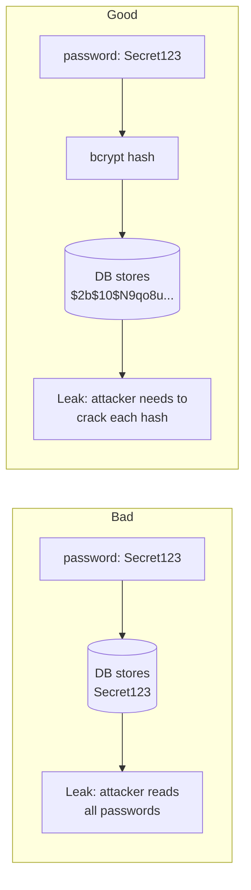
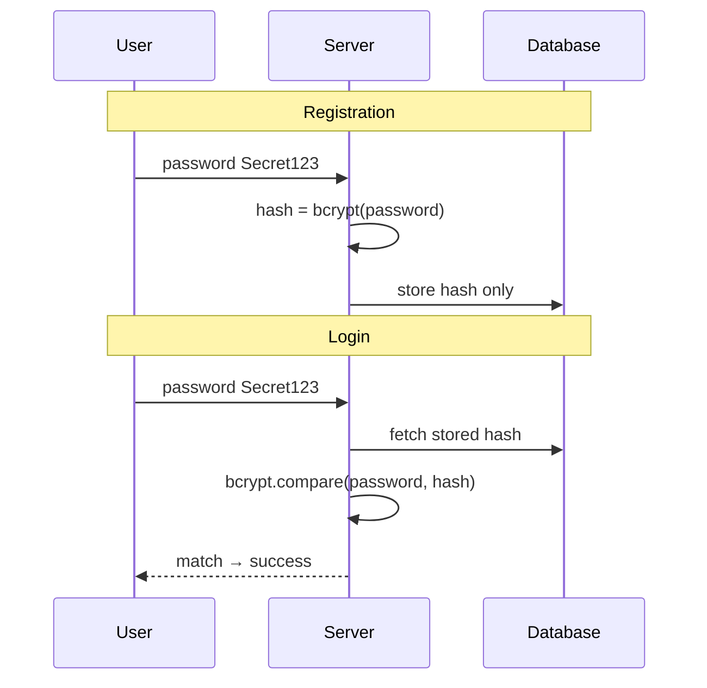
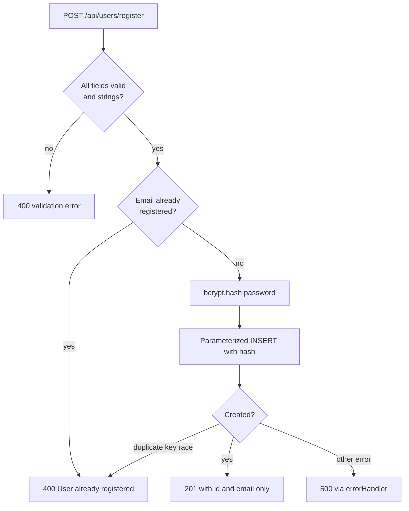

# 04 — User Registration & Password Hashing

> **Goal:** Implement `POST /api/users/register` so that new users are stored in MySQL
> with **hashed** passwords using **bcrypt**, duplicates are rejected, and nothing
> sensitive is sent back.

---

## 1. The Golden Rule

> **Never store a password.** Store a **one-way hash** of it.

Why? Databases get leaked (SQL injection, stolen backups, insider access, cloud
misconfiguration). If passwords are in plain text, one leak compromises every account —
and, because people reuse passwords, their accounts on **other sites** too.



---

## 2. Prerequisite Concept: Encoding vs Encryption vs Hashing

People confuse these three. They solve different problems.

| | **Encoding** | **Encryption** | **Hashing** |
|---|--------------|----------------|-------------|
| Purpose | Represent data in another format | Keep data secret but recoverable | Create a fingerprint; not reversible |
| Reversible? | Yes, by anyone | Yes, **with the key** | **No** (one-way) |
| Needs a key? | No | Yes | No (but may use a *salt*) |
| Examples | Base64, URL-encoding | AES, RSA | SHA-256, bcrypt, argon2 |
| Use for passwords? | ❌ never | ❌ no (key theft = all passwords) | ✅ **yes** (with a slow algorithm) |

Try in Linux:

```bash
echo -n "Secret123" | base64          # encoding   → U2VjcmV0MTIz  (anyone can decode)
echo -n "Secret123" | sha256sum       # fast hash  → deterministic, but too fast for passwords
```

### How login works with hashes
We never "decrypt". We hash the **attempt** the same way and **compare**:



---

## 3. Prerequisite Concept: Why Not Plain SHA-256? Salt and Slowness

### 3.1 Same password → same hash (bad)
SHA-256 of `Secret123` is always the same value. Attackers precompute huge tables
("**rainbow tables**") of common passwords and their hashes and just look them up.

### 3.2 Salt
A **salt** is a random value added to each password **before hashing**:

```
hash( password + salt )
```

- Every user has a **different** salt → identical passwords give different hashes.
- Precomputed tables become useless.
- The salt is **not secret**; it is stored next to the hash.

### 3.3 Slowness (work factor)
General hashes (SHA-256) are made to be **fast** — billions per second on a GPU. For
passwords we want hashing to be deliberately **slow** (~100 ms) so brute-forcing is
impractical. **bcrypt** has a configurable **cost / salt rounds**:

| Salt rounds (cost) | Iterations | Approx. time per hash* |
|--------------------|-----------|-------------------------|
| 8 | 2⁸ = 256 | ~5 ms |
| 10 | 2¹⁰ = 1,024 | ~60–100 ms |
| 12 | 2¹² = 4,096 | ~250–400 ms |
| 14 | 2¹⁴ = 16,384 | ~1 s |

*Depends on hardware. Each +1 doubles the time. **10–12** is a common range today;
re-check cost every few years.

### 3.4 Anatomy of a bcrypt hash

```
$2b$10$N9qo8uLOickgx2ZMRZoMyeIjZAgcfl7p92ldGxad68LJZdL17lhWy
 │  │  └──────── 22 chars: salt ─────┴──── 31 chars: hash ────┘
 │  └── cost factor (10)
 └──── algorithm version
```

Everything bcrypt needs (version, cost, salt, hash) is inside one 60-character string,
so you store a single field. `bcrypt.compare` extracts the salt and cost itself.

### 3.5 Alternatives
| Algorithm | Notes |
|-----------|-------|
| **bcrypt** | Mature, widely supported (this course) |
| **argon2id** | Modern winner of the Password Hashing Competition; memory-hard |
| **scrypt** | Memory-hard, built into Node `crypto.scrypt` |
| PBKDF2 | Standards-friendly, older |

bcrypt limitation: only the **first 72 bytes** of the password are used (hence our max
length of 72).

---

## 4. Step 1 — Install bcrypt

```bash
npm install bcrypt
```

`bcrypt` uses native code (needs build tools or prebuilt binaries). If installation
fails on your machine, use the pure-JavaScript `bcryptjs` (same API, slower):

```bash
npm install bcryptjs
# import bcrypt from 'bcryptjs';
```

### Core API

```js
import bcrypt from 'bcrypt';

const hash = await bcrypt.hash('Secret123', 10);       // salt generated automatically
const ok = await bcrypt.compare('Secret123', hash);    // true
const bad = await bcrypt.compare('wrong', hash);       // false
```

Always use the **async** versions (`hash`, `compare`). The `...Sync` versions block the
event loop for ~100 ms per call — your server would freeze for every request.

Quick demo script `scripts/hash-demo.js`:

```js
import bcrypt from 'bcrypt';

const password = 'Secret123';
console.time('hash');
const h1 = await bcrypt.hash(password, 10);
console.timeEnd('hash');
const h2 = await bcrypt.hash(password, 10);

console.log(h1);
console.log(h2);
console.log('Hashes differ?', h1 !== h2);                       // true (different salts)
console.log('Compare h1:', await bcrypt.compare(password, h1)); // true
console.log('Compare h2:', await bcrypt.compare(password, h2)); // true
```

Run: `node scripts/hash-demo.js`. Notice two different hashes for the same password, both
valid.

---

## 5. Step 2 — The Registration Flow



---

## 6. Step 3 — The Controller

`controllers/userController.js`:

```js
import bcrypt from 'bcrypt';
import { findUserByEmail, createUser } from '../models/userModel.js';
import { HttpError } from '../utils/HttpError.js';

const EMAIL_RE = /^[^\s@]+@[^\s@]+\.[^\s@]+$/;
const SALT_ROUNDS = 10;

// @desc    Register a user
// @route   POST /api/users/register
// @access  Public
export const registerUser = async (req, res) => {
  const { username, email, password } = req.body ?? {};

  // 1) validate presence and types
  if (![username, email, password].every((v) => typeof v === 'string' && v.trim())) {
    throw new HttpError(400, 'All fields are mandatory');
  }
  if (username.trim().length < 3 || username.length > 50) {
    throw new HttpError(400, 'username must be 3–50 characters');
  }
  if (!EMAIL_RE.test(email) || email.length > 254) {
    throw new HttpError(400, 'A valid email is required');
  }
  if (password.length < 8 || password.length > 72) {
    throw new HttpError(400, 'password must be 8–72 characters');
  }

  // 2) email must be unique (normalised the same way the schema does)
  const normalizedEmail = email.trim().toLowerCase();
  const userAvailable = await findUserByEmail(normalizedEmail);
  if (userAvailable) {
    throw new HttpError(400, 'User already registered');
  }

  // 3) hash the password
  const hashedPassword = await bcrypt.hash(password, SALT_ROUNDS);

  // 4) save — only whitelisted fields (no mass assignment)
  const user = await createUser({
    username: username.trim(),
    email: normalizedEmail,
    password: hashedPassword,
  });

  // 5) respond — NEVER include the password hash
  res.status(201).json({ id: user.id, email: user.email });
};
```

### Line-by-line highlights

| Step | Why |
|------|-----|
| Type + presence checks | Reject malformed request values before database work |
| `trim().toLowerCase()` | `Asha@Mail.com` and `asha@mail.com` must be the same account |
| Email pre-check before insert | Friendly error message for the normal case |
| `bcrypt.hash(password, 10)` | Salted, slow, one-way hash |
| Explicit SQL columns and values | Prevents **mass assignment** (`role`, `isAdmin`) from the body |
| Response `id` + `email` | Do not return the hash; do not return the whole row |
| `user.id` | MySQL `AUTO_INCREMENT` primary key |

---

## 7. Step 4 — Handle the Race Condition (Duplicate Key)

Two simultaneous requests with the same email could both pass the pre-check (neither exists
yet) and then both try to insert. The **unique index** saves us: one insert succeeds, the
other throws MySQL error code `ER_DUP_ENTRY`.

Handle it in the error handler so every controller benefits.

`middleware/errorHandler.js` (add a branch):

```js
export const errorHandler = (err, req, res, next) => {
  if (res.headersSent) return next(err);

  // MySQL duplicate key (unique index violation)
  if (err.code === 'ER_DUP_ENTRY') {
    return res.status(409).json({
      status: 409,
      message: 'A record with that value already exists',
    });
  }

  const status = err.status || 500;
  const isProd = process.env.NODE_ENV === 'production';
  if (status >= 500) console.error(err);

  res.status(status).json({
    status,
    message: status >= 500 && isProd ? 'Internal Server Error' : err.message,
    ...(err.details && { details: err.details }),
  });
};
```

The pre-check (`findUserByEmail`) gives a nice 400; the unique constraint plus this branch gives a
**guarantee** (409) under concurrency. Both layers matter — never rely only on the
application check.

---

## 8. Step 5 — Test Registration

### Success
`POST /api/users/register`

```json
{
  "username": "asha",
  "email": "asha@example.com",
  "password": "Secret123!"
}
```

Response `201`:

```json
{ "id": 42, "email": "asha@example.com" }
```

### Verify in the MySQL client
```sql
SELECT id, username, email, password, created_at, updated_at
FROM users
WHERE email = 'asha@example.com';
```

The `password` field is a **hash**, not `Secret123!`.

### Test matrix

| # | Body | Expected |
|---|------|----------|
| 1 | valid | 201 + `id`, `email` |
| 2 | same email again | 400 `User already registered` |
| 3 | same email, different case (`ASHA@Example.com`) | 400 |
| 4 | missing `password` | 400 |
| 5 | `password: "short"` | 400 |
| 6 | `email: "not-an-email"` | 400 |
| 7 | `email: ["not", "an email"]` | 400 (type check) |
| 8 | `password: 12345678` (number) | 400 |
| 9 | extra field `"role": "admin"` | 201 but **ignored** |
| 10 | 5 MB body | 413 (set `express.json({ limit })`) |

### curl
```bash
curl -i -X POST http://localhost:5000/api/users/register \
  -H "Content-Type: application/json" \
  -d '{"username":"asha","email":"asha@example.com","password":"Secret123!"}'
```

---

## 9. Keep Password Hashing in the Controller

MySQL has no application schema middleware. Hash the password in the controller (or an
explicitly shared service) before inserting it. Never hash it in SQL or store the
plain-text value.

```js
import bcrypt from 'bcrypt';
import { pool } from '../config/dbConnection.js';

const hashedPassword = await bcrypt.hash(password, 10);
await pool.execute(
  'UPDATE users SET password = ? WHERE id = ?',
  [hashedPassword, userId]
);
```

Hash explicitly before every password insert or change. Keep that behavior in one
shared service if more than one route updates passwords; never rely on hidden database
triggers for password hashing.

---

## 10. Password Policy and UX

| Practice | Reason |
|----------|--------|
| Minimum length 8 (12+ is better) | Length beats complexity |
| Allow long passphrases (up to 72 for bcrypt) | Encourages memorable secrets |
| Do not force weird symbol rules | Leads to `Password1!` patterns |
| Check against common/breached passwords | e.g., "Have I Been Pwned" k-anonymity API |
| Never trim or alter the password | Spaces can be intentional |
| Support password managers | `autocomplete="new-password"` on the form |
| Rate-limit registration | Stop mass account creation |
| Email verification | Prove ownership (later) |

---

## 11. Security Checklist 🔐

| Threat | Defence |
|--------|---------|
| Database leak | Hash with bcrypt/argon2; unique salt per password |
| Rainbow tables | Salt (automatic in bcrypt) |
| Brute force on hashes | Work factor 10–12+; strong password policy |
| Mass assignment | Create with explicit fields only |
| SQL injection | `pool.execute()` placeholders; never concatenate user values |
| Account enumeration at registration | Trade-off: "already registered" reveals existence; mitigate with rate limits, or send an email either way |
| Credential stuffing | Rate limiting, 2FA, breached-password checks |
| Logging secrets | Never log `req.body` for auth routes |
| Timing / DoS by huge passwords | Max length 72, body size limit |
| Plain HTTP | HTTPS only; HSTS |
| Returning hash in API | Return minimal fields; public queries omit `password` |

> Your `password` field must never appear in logs, API responses, error messages or
> analytics. If it does, treat it as an incident.

---

## 12. Common Mistakes

| Mistake | Symptom | Fix |
|---------|---------|-----|
| Forgetting `await bcrypt.hash` | Stores `Promise {}` / `[object Promise]` | `await` |
| Using `hashSync` | Server freezes under load | Async functions |
| Hashing twice | Login always fails | Hash in one place only |
| Returning the whole `user` object | Hash leaked in response | Return selected fields |
| Comparing with `===` | Always false | `bcrypt.compare` |
| Not lowercasing email | Duplicate accounts by case | Normalise |
| Relying only on an application pre-check | Race condition duplicates | Unique constraint + `ER_DUP_ENTRY` handler |
| Storing `salt` separately (not needed) | Complexity | bcrypt embeds it |
| Salt rounds 4 for "speed" | Weak | Use 10–12 |
| Hash column too short in SQL (varchar 50) | Truncated hash | Use ≥ 60 chars |
| Trimming passwords | Users cannot log in later | Never modify it |

---

## 13. Exercises

1. Install bcrypt and run the demo script; observe two different hashes for one password.
2. Measure hash time for cost 8, 10, 12, 14 with `console.time`.
3. Implement `registerUser` and register a user; check the hash with a MySQL `SELECT`.
4. Register the same email twice; confirm a clean 400 message.
5. Add the `ER_DUP_ENTRY` branch to `errorHandler` and simulate a race using two curl commands
   in parallel (`&`).
6. Try to register with `"role": "admin"` in the body and verify it is ignored.
7. Send `email` as an object and a numeric password; confirm 400.
8. Check that the `findUserById` query does not select or return the password hash.

### Challenge
Write a small script that registers 20 users in a loop and measures total time at cost
10 and cost 13. Explain why a **login endpoint** needs rate limiting because of this
cost (hint: CPU-bound work and DoS).

<details><summary>Hint</summary>

Each hash is intentionally expensive (CPU). An attacker flooding login/register forces
your server to spend ~100 ms CPU per request. Rate limits and small body limits protect
availability.
</details>

---

## 14. Quick Quiz

1. Why do we hash instead of encrypt passwords?
2. What is a salt and who needs to keep it secret?
3. Why is bcrypt deliberately slow?
4. Why use the async bcrypt functions?
5. What does `$2b$10$` mean at the start of a bcrypt hash?
6. Why return only `id` and `email` after registration?
7. How do we handle two simultaneous registrations with the same email?
8. What is mass assignment?

<details><summary>Answers</summary>

1. Hashes are one-way; encryption keys can be stolen, exposing all passwords.
2. Random per-password value that defeats precomputed tables; it is not secret.
3. To make brute-force guessing expensive.
4. Sync versions block the event loop.
5. Algorithm version 2b and cost factor 10.
6. Never expose the hash or unneeded data.
7. Unique constraint → `ER_DUP_ENTRY` → mapped to 409 in the error handler.
8. Letting clients set fields they should not by copying the whole body into the model.
</details>

---

## 15. Summary

- Never store plain passwords; store a **salted, slow, one-way hash** (bcrypt).
- Register flow: validate → normalise → check duplicate → hash → create with explicit
  fields → return minimal data (201).
- Use a unique constraint plus `ER_DUP_ENTRY` handling to be safe under concurrency.
- Use async bcrypt functions; cap password length (72 bytes); keep hashes out of
  responses and logs.

---

## 16. Next Lesson

➡️ **05 — What is JWT?**
Before using tokens, understand exactly what a JSON Web Token is and why it works.
