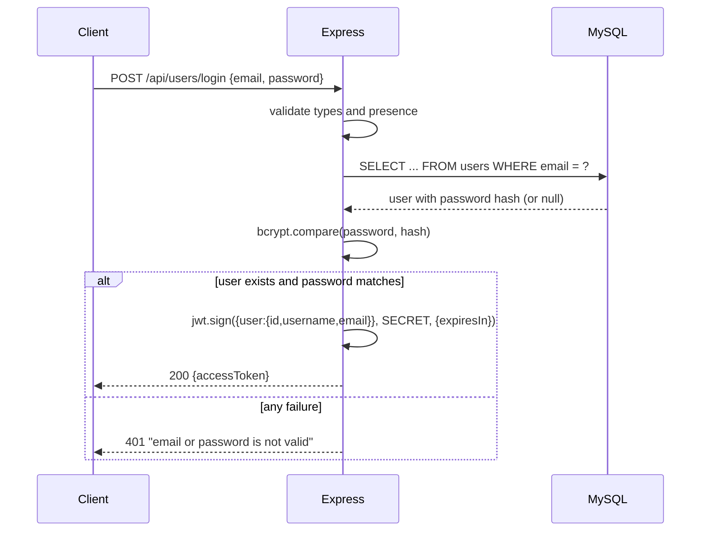

# 06 — User Login & JWT Access Token

> **Goal:** Implement `POST /api/users/login`: find the user, compare the password with
> bcrypt, and return a signed **JWT access token**. Do it securely (generic errors,
> minimal payload, expiry).

---

## 1. The Login Flow



---

## 2. Setup

### Install
```bash
npm install jsonwebtoken
```

### Create a strong secret
```bash
openssl rand -hex 32
```

### `.env`
```
PORT=5000
DB_HOST=127.0.0.1
DB_PORT=3306
DB_NAME=mycontacts
DB_USER=mycontacts_app
DB_PASSWORD=replace-with-a-local-secret
ACCESS_TOKEN_SECRET=put-the-64-hex-characters-you-generated-here
ACCESS_TOKEN_EXPIRES_IN=15m
```

> 🔐 Add `ACCESS_TOKEN_SECRET` to your hosting platform's secrets too. Never commit it.

### Fail fast if the secret is missing
In `server.js` (top):

```js
if (!process.env.ACCESS_TOKEN_SECRET || process.env.ACCESS_TOKEN_SECRET.length < 32) {
  console.error('ACCESS_TOKEN_SECRET must be set and at least 32 characters');
  process.exit(1);
}
```

A server that starts without a secret might sign tokens with `undefined` or throw at the
first login — fail at startup instead.

---

## 3. Prerequisite Concept: Why Generic Error Messages?

Compare two designs:

| Design | Response for unknown email | Response for wrong password |
|--------|---------------------------|-----------------------------|
| ❌ Specific | "User not found" | "Wrong password" |
| ✅ Generic | "email or password is not valid" | same message |

Specific messages enable **user enumeration**: an attacker tests thousands of emails and
learns which are registered, then focuses password guessing / phishing on them.

Also keep the **status identical** (401) and, ideally, similar **timing**.

### Timing side-channel 🔐
If the email does not exist we skip `bcrypt.compare` (fast, ~1 ms). If it exists we run
bcrypt (~80 ms). An attacker measuring response time can still enumerate users.
Mitigation: compare against a **dummy hash** when the user is missing.

```js
// created once at startup
const DUMMY_HASH = await bcrypt.hash('dummy-password-for-timing', 10);
```

---

## 4. The Login Controller

`controllers/userController.js` (add imports and function):

```js
import bcrypt from 'bcrypt';
import jwt from 'jsonwebtoken';
import { findUserByEmailForLogin } from '../models/userModel.js';
import { HttpError } from '../utils/HttpError.js';

const DUMMY_HASH = await bcrypt.hash('dummy-password-for-timing', 10);

// @desc    Login a user
// @route   POST /api/users/login
// @access  Public
export const loginUser = async (req, res) => {
  const { email, password } = req.body ?? {};

  // 1) validate type and presence
  if (typeof email !== 'string' || typeof password !== 'string' || !email || !password) {
    throw new HttpError(400, 'All fields are mandatory');
  }

  // 2) This login-specific query returns the stored hash.
  const user = await findUserByEmailForLogin(email.trim().toLowerCase());

  // 3) compare (always run bcrypt, even for unknown users, to equalise timing)
  const passwordOk = await bcrypt.compare(password, user ? user.password : DUMMY_HASH);

  if (!user || !passwordOk) {
    throw new HttpError(401, 'email or password is not valid');
  }

  // 4) build the token
  const accessToken = jwt.sign(
    {
      user: {
        id: user.id,
        username: user.username,
        email: user.email,
      },
    },
    process.env.ACCESS_TOKEN_SECRET,
    {
      expiresIn: process.env.ACCESS_TOKEN_EXPIRES_IN || '15m',
      algorithm: 'HS256',
    }
  );

  // 5) respond
  res.status(200).json({ accessToken });
};
```

### Step explanation

| Step | Detail |
|------|--------|
| 1 | `typeof` checks reject malformed input types |
| 2 | The login query selects the password hash for comparison |
| 3 | `bcrypt.compare(plain, hash)` → boolean. Dummy hash keeps timing similar |
| 4 | Payload contains only **non-sensitive** identity info. `expiresIn` adds `exp` |
| 5 | Return only the token (never the password/hash) |

### `jwt.sign(payload, secret, options)`

| Argument | Used here |
|----------|-----------|
| `payload` | `{ user: { id, username, email } }` |
| `secret` | `process.env.ACCESS_TOKEN_SECRET` |
| `options.expiresIn` | `'15m'` (also `'1h'`, `'7d'`, or seconds as number) |
| `options.algorithm` | `'HS256'` (default, explicit is clearer) |

The library automatically adds `iat` (issued at) and `exp` (expires at).

---

## 5. What Goes Inside the Token? (Payload Design)

```json
{
  "user": { "id": 42, "username": "asha", "email": "asha@example.com" },
  "iat": 1760000000,
  "exp": 1760000900
}
```

| Do put | Do **not** put |
|--------|----------------|
| User id (the only truly required thing) | Password or hash |
| Username/email (convenient, low risk) | Payment data, phone, address |
| Role (if you have roles) — but remember staleness | Secrets/API keys |
| `iat/exp` (added automatically) | Large objects |

Standard-compliant alternative: `{ sub: user.id }` (the `sub` claim). We use a `user`
object for readability; either works.

Because the token is readable by anyone who has it, assume **everything in it is public
to the token holder**.

---

## 6. Step-by-Step Testing

### 1) Register a user first
`POST /api/users/register`:

```json
{ "username": "asha", "email": "asha@example.com", "password": "Secret123!" }
```

### 2) Log in
`POST /api/users/login`:

```json
{ "email": "asha@example.com", "password": "Secret123!" }
```

Response `200`:

```json
{
  "accessToken": "eyJhbGciOiJIUzI1NiIsInR5cCI6IkpXVCJ9.eyJ1c2VyIjp7...}.AbC..."
}
```

### 3) Inspect the token
```bash
TOKEN="paste-the-token"
echo "$TOKEN" | cut -d. -f2 | tr '_-' '/+' | base64 -d 2>/dev/null; echo
```

You should see the payload with `user`, `iat`, `exp`. (Add `=` padding if `base64`
complains.)

### 4) Test matrix

| # | Request body | Expected |
|---|--------------|----------|
| 1 | correct email + password | 200 + `accessToken` |
| 2 | correct email, wrong password | 401 `email or password is not valid` |
| 3 | unknown email | 401 **same message** |
| 4 | email in different case (`ASHA@Example.com`) | 200 (normalised) |
| 5 | missing password | 400 |
| 6 | `email: ["not", "a", "string"]` | 400 |
| 7 | `password: 12345` | 400 |
| 8 | empty body | 400 |
| 9 | very long password (10 KB) | 400/413 (limit body size) |

### curl
```bash
curl -s -X POST http://localhost:5000/api/users/login \
  -H "Content-Type: application/json" \
  -d '{"email":"asha@example.com","password":"Secret123!"}'
```

---

## 7. Postman Convenience: Save the Token Automatically

In the **Login** request → **Tests** tab:

```js
const data = pm.response.json();
if (data.accessToken) {
  pm.environment.set('token', data.accessToken);
}
```

For other requests: **Authorization → Bearer Token → `{{token}}`**.

Now you never copy/paste tokens by hand. (We use it from lesson 7 onward.)

---

## 8. Test Expiry Quickly

Set a short lifetime in `.env`:

```
ACCESS_TOKEN_EXPIRES_IN=1m
```

Restart, log in, use the token after a minute: lesson 8's middleware will answer 401
"token expired". Remember to set it back to `15m`.

Time formats accepted by `expiresIn` (library `ms`):

| Value | Meaning |
|-------|---------|
| `60` | 60 **seconds** (number) |
| `'60'` | 60 **milliseconds** (string without unit — avoid!) |
| `'15m'` | 15 minutes |
| `'2h'` | 2 hours |
| `'7d'` | 7 days |

---

## 9. Security Checklist 🔐

| Threat | Defence |
|--------|---------|
| Brute-force / credential stuffing | **Rate limit** login (e.g., `express-rate-limit`: 5 attempts / 15 min / IP + per email), account lockout/backoff, CAPTCHA, 2FA |
| User enumeration | Generic message + same status + similar timing |
| Token theft | HTTPS, short expiry, avoid localStorage if XSS risk, refresh tokens |
| Weak secret | `openssl rand -hex 32`, env var, rotation |
| Algorithm attacks | Specify `algorithm: 'HS256'` at sign and `algorithms: ['HS256']` at verify |
| Sensitive data in payload | Keep minimal |
| SQL injection | Input checks + parameterized queries |
| Logging credentials | Do not log `req.body` on auth routes |
| Verbose errors | Never reveal which part failed |
| Plain HTTP | Enforce HTTPS + HSTS in production |

Simple rate limiting example:

```bash
npm install express-rate-limit
```
```js
import rateLimit from 'express-rate-limit';

const loginLimiter = rateLimit({
  windowMs: 15 * 60 * 1000,
  limit: 10,
  standardHeaders: true,
  legacyHeaders: false,
  message: { status: 429, message: 'Too many login attempts, try again later' },
});

router.post('/login', loginLimiter, loginUser);
```

---

## 10. Where Do We Return the Token? (Body vs Cookie)

| Option | Code | Notes |
|--------|------|-------|
| **Response body** (this course) | `res.json({ accessToken })` | Client stores and sends in `Authorization` header. Works for mobile and SPAs |
| **HttpOnly cookie** | `res.cookie('token', t, { httpOnly: true, secure: true, sameSite: 'strict', maxAge: 15*60*1000 })` | JS cannot read it (XSS-resistant); needs `cookie-parser` and CSRF thinking |

We follow the syllabus: token in the body, header on later requests.

---

## 11. Complete Controller After This Lesson

```js
import bcrypt from 'bcrypt';
import jwt from 'jsonwebtoken';
import {
  findUserByEmail,
  findUserByEmailForLogin,
  createUser,
} from '../models/userModel.js';
import { HttpError } from '../utils/HttpError.js';

const EMAIL_RE = /^[^\s@]+@[^\s@]+\.[^\s@]+$/;
const SALT_ROUNDS = 10;
const DUMMY_HASH = await bcrypt.hash('dummy-password-for-timing', SALT_ROUNDS);

export const registerUser = async (req, res) => {
  const { username, email, password } = req.body ?? {};

  if (![username, email, password].every((v) => typeof v === 'string' && v.trim())) {
    throw new HttpError(400, 'All fields are mandatory');
  }
  if (!EMAIL_RE.test(email) || password.length < 8 || password.length > 72) {
    throw new HttpError(400, 'Invalid email or password length (8–72)');
  }

  const normalizedEmail = email.trim().toLowerCase();
  if (await findUserByEmail(normalizedEmail)) {
    throw new HttpError(400, 'User already registered');
  }

  const hashedPassword = await bcrypt.hash(password, SALT_ROUNDS);
  const user = await createUser({
    username: username.trim(),
    email: normalizedEmail,
    password: hashedPassword,
  });

  res.status(201).json({ id: user.id, email: user.email });
};

export const loginUser = async (req, res) => {
  const { email, password } = req.body ?? {};
  if (typeof email !== 'string' || typeof password !== 'string' || !email || !password) {
    throw new HttpError(400, 'All fields are mandatory');
  }

  const user = await findUserByEmailForLogin(email.trim().toLowerCase());
  const passwordOk = await bcrypt.compare(password, user ? user.password : DUMMY_HASH);

  if (!user || !passwordOk) {
    throw new HttpError(401, 'email or password is not valid');
  }

  const accessToken = jwt.sign(
    { user: { id: user.id, username: user.username, email: user.email } },
    process.env.ACCESS_TOKEN_SECRET,
    { expiresIn: process.env.ACCESS_TOKEN_EXPIRES_IN || '15m', algorithm: 'HS256' }
  );

  res.status(200).json({ accessToken });
};

export const currentUser = async (req, res) => {
  res.json({ message: 'Current user information' });     // protected in lessons 7–8
};
```

---

## 12. Common Mistakes

| Mistake | Symptom | Fix |
|---------|---------|-----|
| Login query omits the hash | `user.password` undefined → bcrypt error `data and hash arguments required` | Use `findUserByEmailForLogin` |
| `bcrypt.compare(hash, password)` (swapped) | Always false | `(plain, hash)` order |
| Different messages for unknown email vs wrong password | User enumeration | One generic message |
| Secret undefined | `secretOrPrivateKey must have a value` | Set `.env`; check startup |
| Putting `user` (whole database row) in payload | Huge token with hash/internal fields | Pick fields |
| `expiresIn: '15'` (string) | 15 **ms** → token expires instantly | `'15m'` or number seconds |
| Using `user._id` | Column does not exist | Use MySQL's `user.id` |
| Returning `user` and `accessToken` with hash | Leak | Only token |
| No rate limiting | Brute force possible | `express-rate-limit` |
| Logging the token | Anyone with logs can impersonate | Don't log |
| Not restarting after changing `.env` | Old values | Restart |

---

## 13. Exercises

1. Add `jsonwebtoken` and a 64-hex secret to `.env`; add the startup check.
2. Implement `loginUser` and log in with your registered user.
3. Decode the token payload in the terminal; identify `iat` and `exp`; convert with `date -d`.
4. Test wrong password and unknown email; confirm identical responses.
5. Measure response times for unknown vs known email with and without the dummy hash
   (`curl -w "%{time_total}\n"`).
6. Add `express-rate-limit` to login and trigger the 429 response.
7. Set `ACCESS_TOKEN_EXPIRES_IN=1m` and confirm the `exp - iat` difference is 60.
8. Save the token with a Postman test script and view `{{token}}` in the environment.

### Challenge
Add a `jti` (unique id) claim using `crypto.randomUUID()` via the `jwtid` option and keep
a small in-memory deny-list. Write a `POST /api/users/logout` that adds the token's
`jti` to the list (you will check it in the middleware of lesson 8). Discuss the
limitations of an in-memory list (restarts, multiple servers).

<details><summary>Hint</summary>

`jwt.sign(payload, secret, { expiresIn: '15m', jwtid: crypto.randomUUID() })`. In the
middleware: `if (denyList.has(decoded.jti)) throw new HttpError(401, ...)`. For production
use Redis with TTL equal to the token's remaining lifetime.
</details>

---

## 14. Quick Quiz

1. Why do we return the same message for unknown email and wrong password?
2. Why does login use a query that selects the password hash?
3. What does `expiresIn: '15m'` add to the token?
4. Why compare against a dummy hash when the user is missing?
5. Which status code do we return for failed login?
6. What must never be placed inside the JWT payload?
7. Why specify `algorithm: 'HS256'`?
8. Why is `bcrypt.compare(hash, password)` wrong?

<details><summary>Answers</summary>

1. To prevent user enumeration.
2. Public user queries omit the password; only the login query selects the hash.
3. An `exp` claim (and `iat` is added automatically).
4. To keep response timing similar and avoid timing-based enumeration.
5. 401.
6. Passwords, secrets or sensitive personal data.
7. Explicit, safe algorithm choice; avoids misconfiguration/confusion.
8. Argument order is `(plainPassword, hash)`.
</details>

---

## 15. Summary

- Login = find user → `bcrypt.compare` → `jwt.sign` → return `{ accessToken }`.
- Use generic 401 messages, equalise timing, validate input types.
- Keep the payload minimal; set `expiresIn`; read secret from `.env` and fail fast if absent.
- Add rate limiting; use HTTPS; remember the token is readable and powerful.

---

## 16. Next Lesson

➡️ **07 — Protecting Routes: User**
Require the token for `GET /api/users/current` and see why we need reusable middleware.
