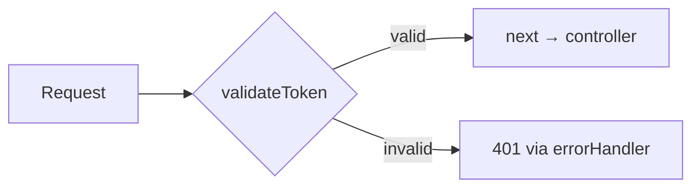
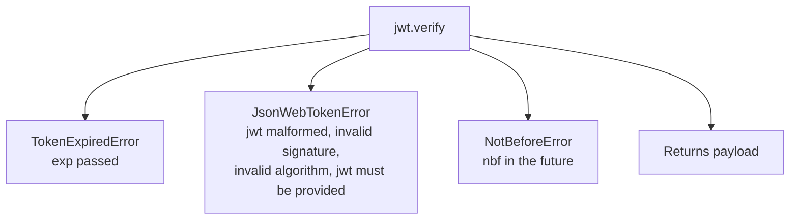
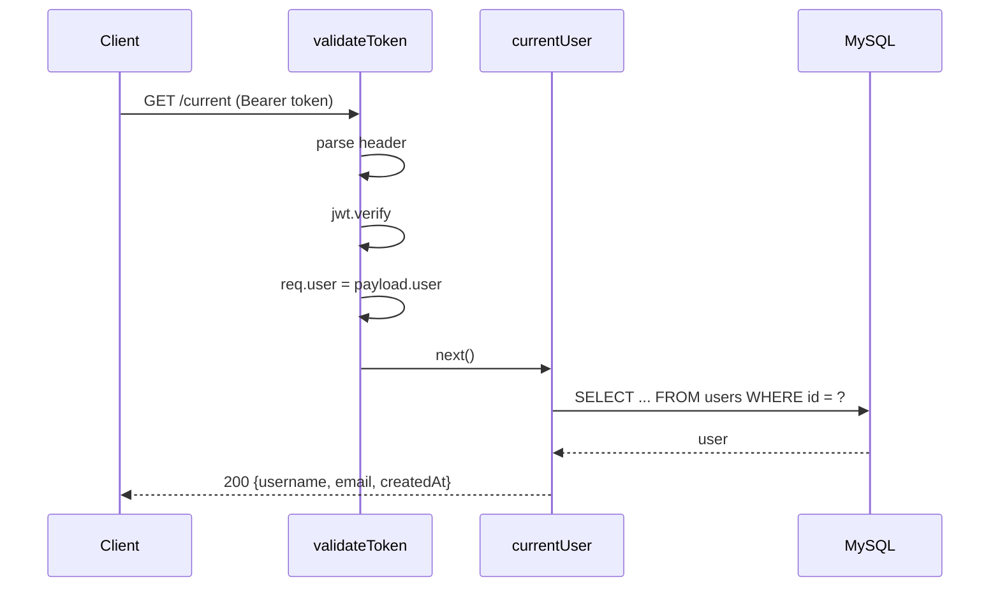
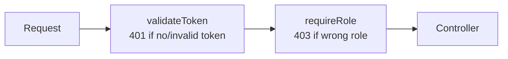

# 08 — Verify JWT Token Middleware

> **Goal:** Build a reusable `validateToken` middleware that reads the Bearer token,
> verifies it, attaches `req.user`, and calls `next()` — or rejects with 401. Then
> protect routes with it.

---

## 1. Recap: What Middleware Is

```js
(req, res, next) => {
  // do something
  next();     // continue
}
```

A middleware **either** responds **or** calls `next()` (Express course lesson 23).
`validateToken` is a perfect case: *guard clause* before every private controller.



---

## 2. Design Decisions

| Question | Decision |
|----------|----------|
| Where does the token come from? | `Authorization: Bearer <token>` header |
| How to verify? | `jwt.verify(token, secret, { algorithms: ['HS256'] })` |
| What do we store on the request? | `req.user = decoded.user` |
| How to report failure? | `throw new HttpError(401, ...)` → central `errorHandler` |
| Async or sync? | Sync verification is fine (no I/O) |
| Check DB? | Optional extra middleware/step; not by default |

---

## 3. The Middleware

`middleware/validateTokenHandler.js`:

```js
import jwt from 'jsonwebtoken';
import { HttpError } from '../utils/HttpError.js';

export const validateToken = (req, res, next) => {
  // 1) get the Authorization header (case-insensitive helper)
  const authHeader = req.get('Authorization');

  if (!authHeader) {
    throw new HttpError(401, 'User is not authorized or token is missing');
  }

  // 2) must be: "Bearer <token>"
  const [scheme, token, ...rest] = authHeader.split(' ');

  if (scheme !== 'Bearer' || !token || rest.length > 0) {
    throw new HttpError(401, 'User is not authorized or token is missing');
  }

  // 3) verify signature, expiry, algorithm
  try {
    const decoded = jwt.verify(token, process.env.ACCESS_TOKEN_SECRET, {
      algorithms: ['HS256'],
    });

    // 4) expose the identity to later handlers
    req.user = decoded.user;
  } catch (err) {
    if (err.name === 'TokenExpiredError') {
      throw new HttpError(401, 'Token expired');
    }
    throw new HttpError(401, 'User is not authorized');
  }

  // 5) continue
  next();
};
```

### Why `throw` works in middleware
Express catches synchronous throws from middleware and sends them to the error handler.
In Express 4 sync `throw` also works; only **async** functions need wrappers.

### Parsing details
```js
const [scheme, token, ...rest] = authHeader.split(' ');
```
- `Bearer abc` → scheme `Bearer`, token `abc`, `rest []` ✅
- `Bearer` → token `undefined` ❌
- `Bearer a b` → `rest ['b']` ❌ (malformed)
- `bearer abc` → scheme mismatch ❌ (RFC says scheme is case-insensitive; being strict is
  fine for an API you control; use `scheme.toLowerCase() === 'bearer'` to be lenient)

---

## 4. Understanding the Errors From `jsonwebtoken`



| Error `name` | `message` examples | When |
|--------------|--------------------|------|
| `TokenExpiredError` | `jwt expired` | `exp` in the past (has `expiredAt`) |
| `JsonWebTokenError` | `jwt malformed`, `invalid signature`, `invalid token`, `jwt must be provided` | Bad structure/signature |
| `NotBeforeError` | `jwt not active` | `nbf` in the future |

**Client experience:** returning a distinct `Token expired` message lets front-ends
trigger a silent refresh/login. Keep everything else generic.

---

## 5. Using the Middleware on Routes

### Per route
```js
import { validateToken } from '../middleware/validateTokenHandler.js';

router.get('/current', validateToken, currentUser);
```

The array of handlers runs left to right: `validateToken` first; if it calls `next()`,
`currentUser` runs.

### Whole router (preferred for fully private resources)
```js
const router = express.Router();
router.use(validateToken);          // everything below requires a token
router.get('/', getContacts);
router.post('/', createContact);
```

### Whole path in `server.js`
```js
app.use('/api/contacts', validateToken, contactRoutes);
```

### Public routes with exceptions
```js
router.post('/register', registerUser);        // defined BEFORE router.use
router.post('/login', loginUser);
router.use(validateToken);                     // from here on: private
router.get('/current', currentUser);
```

**Order matters:** `router.use(validateToken)` only affects routes defined **after** it.

---

## 6. Simplify `currentUser`

Now the controller can trust `req.user`:

```js
import { findUserById } from '../models/userModel.js';
import { HttpError } from '../utils/HttpError.js';

// @desc    Current user info
// @route   GET /api/users/current
// @access  Private
export const currentUser = async (req, res) => {
  const user = await findUserById(req.user.id);

  if (!user) {
    throw new HttpError(401, 'User no longer exists');
  }

  res.set('Cache-Control', 'no-store');
  res.status(200).json(user);
};
```

Compare with lesson 7: 15 lines of token handling vanished from the controller.



---

## 7. Complete Files

### `middleware/validateTokenHandler.js`
```js
import jwt from 'jsonwebtoken';
import { HttpError } from '../utils/HttpError.js';

export const validateToken = (req, res, next) => {
  const authHeader = req.get('Authorization');
  if (!authHeader) {
    throw new HttpError(401, 'User is not authorized or token is missing');
  }

  const [scheme, token, ...rest] = authHeader.split(' ');
  if (scheme !== 'Bearer' || !token || rest.length) {
    throw new HttpError(401, 'User is not authorized or token is missing');
  }

  try {
    const decoded = jwt.verify(token, process.env.ACCESS_TOKEN_SECRET, {
      algorithms: ['HS256'],
    });
    req.user = decoded.user;
  } catch (err) {
    throw new HttpError(
      401,
      err.name === 'TokenExpiredError' ? 'Token expired' : 'User is not authorized'
    );
  }

  next();
};
```

### `routes/userRoutes.js`
```js
import express from 'express';
import { registerUser, loginUser, currentUser } from '../controllers/userController.js';
import { validateToken } from '../middleware/validateTokenHandler.js';

const router = express.Router();

router.post('/register', registerUser);
router.post('/login', loginUser);
router.get('/current', validateToken, currentUser);

export default router;
```

---

## 8. Testing the Middleware

### Matrix

| # | Test | Expected |
|---|------|----------|
| 1 | No header | 401 `User is not authorized or token is missing` |
| 2 | `Authorization: Basic abc` | 401 same |
| 3 | `Authorization: Bearer` | 401 same |
| 4 | `Authorization: Bearer a b` | 401 same |
| 5 | `Authorization: Bearer garbage` | 401 `User is not authorized` |
| 6 | Valid token | 200 + user |
| 7 | Token signed with another secret | 401 `User is not authorized` |
| 8 | Expired token (set expiry to `10s`, wait) | 401 `Token expired` |
| 9 | Valid token but user deleted in DB | 401 `User no longer exists` |
| 10 | `alg: none` token | 401 `User is not authorized` |

### Craft an `alg: none` token to prove protection
```js
// scripts/none-token.js
const b64 = (o) => Buffer.from(JSON.stringify(o)).toString('base64url');
console.log(`${b64({ alg: 'none', typ: 'JWT' })}.${b64({ user: { id: 'x' } })}.`);
```
Send it as a Bearer token. Because we pass `algorithms: ['HS256']`, verification fails.

### Craft a signed-with-wrong-secret token
```js
import jwt from 'jsonwebtoken';
console.log(jwt.sign({ user: { id: 'x' } }, 'attacker-secret'));
```

### Expiry
`ACCESS_TOKEN_EXPIRES_IN=10s` → login → wait 11 seconds → call `/current` → "Token expired".

### Postman tests
```js
pm.test('401 for missing token', () => pm.response.to.have.status(401));
pm.test('error shape', () => {
  const j = pm.response.json();
  pm.expect(j).to.have.property('status', 401);
  pm.expect(j).to.have.property('message');
});
```

---

## 9. Variations You Will Meet

### 9.1 Callback style of `jwt.verify`
```js
jwt.verify(token, secret, (err, decoded) => {
  if (err) { res.status(401); throw new Error('User is not authorized'); }
  req.user = decoded.user;
  next();
});
```
Throwing inside a **callback** is not caught by Express (it crashes or hangs), which is a
classic bug. The **synchronous try/catch** version above is safer.

### 9.2 Express 4 + `express-async-handler`
```js
import asyncHandler from 'express-async-handler';
export const validateToken = asyncHandler(async (req, res, next) => { ... });
```
Not needed for our sync version.

### 9.3 Token from a cookie
```js
const token = req.cookies?.token;          // needs cookie-parser
```
Remember CSRF protection when using cookies.

### 9.4 Fresh user check (revocation-like)
```js
export const loadUser = async (req, res, next) => {
  const user = await findUserById(req.user.id);
  if (!user) throw new HttpError(401, 'User no longer exists');
  req.dbUser = user;
  next();
};

router.get('/current', validateToken, loadUser, currentUser);
```

### 9.5 Role-based authorization middleware (preview)
```js
export const requireRole = (...roles) => (req, res, next) => {
  if (!roles.includes(req.user?.role)) {
    throw new HttpError(403, 'You do not have permission');
  }
  next();
};

router.delete('/:id', validateToken, requireRole('admin'), deleteUser);
```



AuthN first (401), then AuthZ (403) — the order of the chain mirrors the concepts from
lesson 1.

---

## 10. Typing and Safety of `req.user`

`req.user` only exists **after** `validateToken`. In a controller behind the middleware it
is always set; if you accidentally use a controller on a public route, `req.user` is
`undefined` and you get `Cannot read properties of undefined (reading 'id')`. Defensive
pattern (optional):

```js
if (!req.user) throw new HttpError(401, 'Not authenticated');
```

Never take identity from the **body or URL** — only from `req.user`:

```js
// ❌ attacker can send any user_id
const { user_id } = req.body;
// ✅ trust only the verified token
const userId = req.user.id;
```

---

## 11. Security Checklist 🔐

| Item | Why |
|------|-----|
| `algorithms: ['HS256']` | Blocks `none` and algorithm confusion |
| Sync try/catch around `verify` | No uncaught errors in callbacks |
| Generic messages except "expired" | Avoid leaking details |
| Identity only from `req.user` | Prevents impersonation via body/params |
| Middleware order (before routes) | Otherwise route handlers run unprotected |
| HTTPS in production | Bearer tokens are credentials |
| Log failures without logging tokens | Detect attacks safely: IP, route, reason code |
| Rate limit failed auth | Slow down token guessing |
| Clock skew tolerance | `clockTolerance: 5` seconds if servers' clocks differ |
| Rotate secrets with grace | Support old+new secrets temporarily if needed |

Logging failures safely:

```js
console.warn(`401 ${req.method} ${req.originalUrl} ip=${req.ip} reason=${err.name}`);
```

---

## 12. Common Mistakes

| Mistake | Symptom | Fix |
|---------|---------|-----|
| Forgot `next()` | Request hangs | Call `next()` on success |
| Called `next()` after sending a response | `ERR_HTTP_HEADERS_SENT` | Throw/return, not both |
| Throwing inside the `verify` callback | Crash/hang | Use sync try/catch |
| Registered `router.use(validateToken)` after routes | Routes unprotected | Place before routes |
| Applied middleware to `/register`/`/login` | Nobody can log in (401) | Keep them public |
| `req.headers.Authorization` | undefined | `req.get('Authorization')` |
| Not restarting after `.env` change | Verification fails | Restart |
| Treating `req.user` as DB document | Methods missing | It's a plain payload object |
| Using `decoded` directly (not `decoded.user`) | `req.user.id` undefined | Match your payload shape |
| Different `ACCESS_TOKEN_SECRET` at sign vs verify | `invalid signature` | One secret |
| Returning HTML errors | `errorHandler` missing/not last | Register it last |

---

## 13. Exercises

1. Create `validateToken` and protect `/api/users/current`.
2. Run the whole test matrix and record each status/message.
3. Craft an `alg: none` token and a wrong-secret token; confirm 401.
4. Add logging of failed attempts (method, URL, IP, error name) without the token.
5. Add `clockTolerance: 5` and explain when it helps.
6. Write `loadUser` middleware that checks the database and use it on `/current`.
7. Write `requireRole('admin')` and test with a token containing `role: 'user'`.
8. Move `router.use(validateToken)` above and below a route and observe the difference.

### Challenge
Build `optionalAuth` middleware: if a valid token is present set `req.user`, otherwise
continue **without** failing (for endpoints that behave differently for logged-in users,
like a public feed with "liked" flags). Make sure an *invalid* token still returns 401 so
errors are not silently ignored.

<details><summary>Hint</summary>

```js
export const optionalAuth = (req, res, next) => {
  if (!req.get('Authorization')) return next();
  return validateToken(req, res, next);
};
```
</details>

---

## 14. Quick Quiz

1. What must a middleware do to continue the chain?
2. Why use `algorithms: ['HS256']` in `verify`?
3. Why should you avoid throwing inside the callback form of `jwt.verify`?
4. Where does the user identity come from in controllers?
5. What does `router.use(validateToken)` affect?
6. Which error name indicates expiry?
7. Why do we throw 401 in `validateToken` but 403 in `requireRole`?

<details><summary>Answers</summary>

1. Call `next()`.
2. To reject `none` and prevent algorithm confusion attacks.
3. Express cannot catch errors thrown asynchronously in callbacks.
4. `req.user`, set by the middleware from the verified token.
5. All routes registered after it on that router.
6. `TokenExpiredError`.
7. 401 = not authenticated; 403 = authenticated but not permitted.
</details>

---

## 15. Summary

- `validateToken` reads `Authorization: Bearer`, verifies with pinned algorithm, sets
  `req.user`, calls `next()`, or throws 401.
- Plug it into routes individually, on a router (`router.use`) or on a path in `server.js`.
- Identity must come only from `req.user`; never from body/params.
- Handle `TokenExpiredError` distinctly; keep other messages generic; log failures safely.
- Chain middleware: authenticate (401) → authorize (403) → controller.

---

## 16. Next Lesson

➡️ **09 — Handle Relationship: User & Contact Schema**
Connect contacts to the user who owns them.
