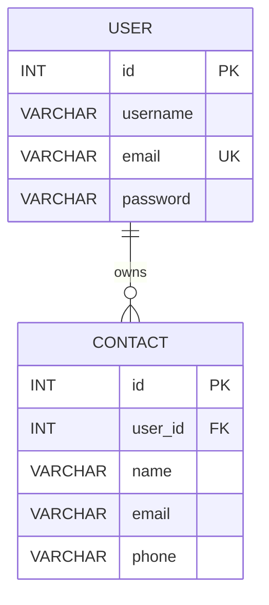

# 09 — Handle Relationship: User & Contact Tables

> **Goal:** Create a MySQL `contacts` table linked to `users` by a foreign key, and
> understand why every contact query must still enforce the authenticated owner's ID.

---

## 1. The Business Rule

> A user can have many contacts. A contact belongs to exactly one user.

This is a one-to-many relationship (1:N). Authentication tells us who is calling; the
foreign key and owner-scoped queries determine which data they may use.



---

## 2. Step 1 — Create the Contact Table

Run this in the `mycontacts` database:

```sql
CREATE TABLE contacts (
  id INT UNSIGNED NOT NULL AUTO_INCREMENT,
  user_id INT UNSIGNED NOT NULL,
  name VARCHAR(100) NOT NULL,
  email VARCHAR(254) NOT NULL,
  phone VARCHAR(20) NOT NULL,
  created_at TIMESTAMP NOT NULL DEFAULT CURRENT_TIMESTAMP,
  updated_at TIMESTAMP NOT NULL DEFAULT CURRENT_TIMESTAMP
    ON UPDATE CURRENT_TIMESTAMP,
  PRIMARY KEY (id),
  INDEX idx_contacts_user_created (user_id, created_at),
  CONSTRAINT fk_contacts_user
    FOREIGN KEY (user_id) REFERENCES users(id)
    ON DELETE CASCADE
);
```

The foreign key prevents a contact from referring to a user that does not exist.
`ON DELETE CASCADE` deletes that user's contacts when the user row is deleted.
The index supports the common query for one user's contacts, sorted newest first.

Confirm the table and its constraints:

```sql
SHOW CREATE TABLE contacts;
SHOW INDEX FROM contacts;
```

---

## 3. Why Use a Foreign Key?

| Concern | MySQL behavior |
|---------|----------------|
| Contact references a missing user | Rejected by the foreign key |
| User is deleted | `ON DELETE CASCADE` removes their contacts |
| Contact query is filtered by owner | Application must include `user_id` in the query |
| Contact belongs to a different user | Authorization must still block access |
| Contacts are read with owner details | Use a SQL `JOIN` |

The database constraint maintains referential integrity; it does **not** authorize API
requests. Never treat an integer ID as a secret or rely on an unguessable ID.

---

## 4. Step 2 — Query the Relationship

The `user_id` must come from the verified token, never from the client:

```js
import { pool } from '../config/dbConnection.js';

// ❌ DANGEROUS: the caller can claim to be another user
const userId = req.body.user_id;

// ✅ Use the identity established by validateToken
const userId = req.user.id;

const [contacts] = await pool.execute(
  `SELECT id, user_id AS userId, name, email, phone,
          created_at AS createdAt, updated_at AS updatedAt
   FROM contacts
   WHERE user_id = ?`,
  [userId]
);
```

Use parameter placeholders for all data values. Do not interpolate the ID into the SQL
string.

### Join the owner details

```js
const [contacts] = await pool.execute(
  `SELECT c.id, c.name, c.email, c.phone, c.created_at AS createdAt,
          u.username, u.email AS ownerEmail
   FROM contacts AS c
   JOIN users AS u ON u.id = c.user_id
   WHERE c.user_id = ?`,
  [req.user.id]
);
```

A join returns relational fields in one query. Select only the owner columns needed;
never select or return the owner's password hash.

### Grouped counts

```sql
SELECT user_id, COUNT(*) AS total
FROM contacts
GROUP BY user_id;
```

This is the SQL equivalent of counting contacts per user. There is no virtual
relationship to configure; use `JOIN`, `GROUP BY`, or a separate query when needed.

---

## 5. Seed Two Users and Their Contacts

Use rows created through the registration endpoint, then add contact rows in MySQL.
For example, look up the generated integer IDs first:

```sql
SELECT id, username, email FROM users;
```

Then insert contacts with parameter values (replace the IDs with the results):

```sql
INSERT INTO contacts (user_id, name, email, phone)
VALUES
  (1, 'Priya', 'priya@x.com', '9876543210'),
  (1, 'Kiran', 'kiran@x.com', '9123456780'),
  (2, 'Meera', 'meera@x.com', '9988776655');
```

Check that each contact points at the expected user:

```sql
SELECT c.id, c.user_id, u.username, c.name
FROM contacts AS c
JOIN users AS u ON u.id = c.user_id
ORDER BY c.id;
```

Never run seed or cleanup statements against production data.

---

## 6. Authorization: Scope Every Query by Owner

Use both the resource ID and the verified owner ID in read, update, and delete queries:

```js
const [rows] = await pool.execute(
  'SELECT id, name, email, phone FROM contacts WHERE id = ? AND user_id = ?',
  [req.params.id, req.user.id]
);

if (rows.length === 0) {
  throw new HttpError(404, 'Contact not found');
}
```

Returning the same 404 for a missing contact and another user's contact avoids leaking
whether the ID exists.

### IDOR / BOLA

This is an insecure direct object reference (IDOR), also called broken object-level
authorization (BOLA):

```js
// ❌ Authenticated, but not authorized: can read anyone's contact
const [rows] = await pool.execute(
  'SELECT * FROM contacts WHERE id = ?',
  [req.params.id]
);
```

Authentication identifies the caller; authorization must scope **every** operation to
that caller:

```sql
SELECT ... FROM contacts WHERE id = ? AND user_id = ?;
UPDATE contacts SET ... WHERE id = ? AND user_id = ?;
DELETE FROM contacts WHERE id = ? AND user_id = ?;
```

---

## 7. Transactions and Cascading Deletes

The foreign key cascade handles a user's contacts automatically. If account deletion
also changes other tables, make those changes in a transaction:

```js
import { pool } from '../config/dbConnection.js';

const connection = await pool.getConnection();
try {
  await connection.beginTransaction();
  await connection.execute('DELETE FROM users WHERE id = ?', [req.user.id]);
  await connection.commit();
} catch (err) {
  await connection.rollback();
  throw err;
} finally {
  connection.release();
}
```

Transactions make the grouped changes all-or-nothing. Always release a checked-out
connection in `finally`.

---

## 8. Security Notes 🔐

| Risk | Defense |
|------|---------|
| IDOR/BOLA | Include `user_id = req.user.id` in every contact query |
| Client-supplied owner | Ignore `req.body.user_id`; use the verified token |
| SQL injection | Parameterize values with `pool.execute()` |
| Orphaned contacts | Enforce the foreign key and cascade behavior |
| Missing index | Add an index beginning with `user_id` |
| Mass assignment | Whitelist fields allowed in create and update handlers |
| Password hash leakage through joins | Select only required user columns |

---

## 9. Common Mistakes

| Mistake | Symptom | Fix |
|---------|---------|-----|
| Using `req.body.user_id` | Caller can create a contact for another user | Use `req.user.id` |
| Looking up only by contact `id` | IDOR/BOLA | Filter by both `id` and `user_id` |
| Concatenating values into SQL | SQL injection | Use placeholders |
| Missing foreign key | Orphaned contacts | Add `FOREIGN KEY (user_id)` |
| Missing owner index | Slow list queries as data grows | Index `(user_id, created_at)` |
| Returning `u.*` from a join | Password hash may leak | Select only public columns |

---

## 10. Summary

- A MySQL foreign key links `contacts.user_id` to `users.id` and enforces integrity.
- `ON DELETE CASCADE` cleans up child contacts when a user is deleted.
- A foreign key does not replace authorization; always scope queries to `req.user.id`.
- Use prepared statements and select only the fields needed.
- Use transactions when account deletion must update multiple tables.
