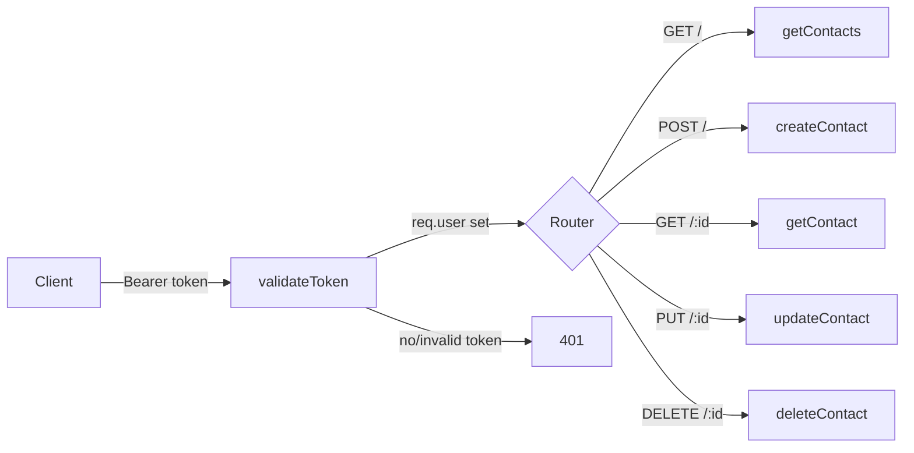
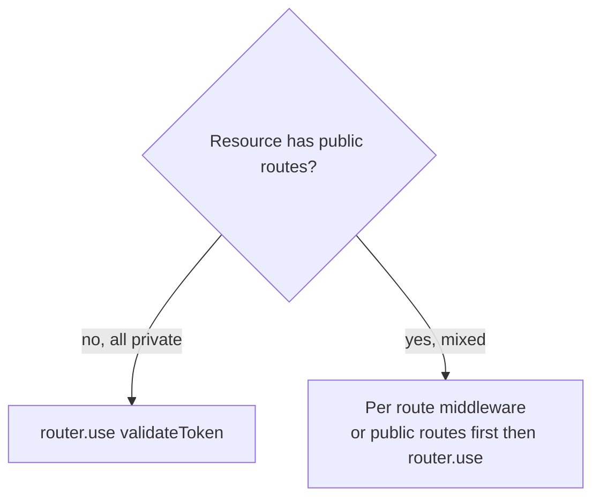
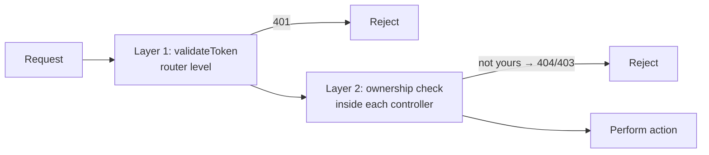

# 10 — Protecting Routes: Contact

> **Goal:** Create the contact routes and controller skeleton, then make **every** contact
> route private with `validateToken`. Learn the different ways to apply middleware and
> how to test that nothing is reachable without a token.

---

## 1. The Contact API Design

All contact endpoints are **private**: they need a valid token, and they only ever touch
the caller's own contacts.

| Method | URL | Purpose | Lesson |
|--------|-----|---------|--------|
| `GET` | `/api/contacts` | List my contacts | 11 |
| `GET` | `/api/contacts/:id` | Get one of my contacts | 11 |
| `POST` | `/api/contacts` | Create a contact | 12 |
| `PUT` | `/api/contacts/:id` | Update a contact | 13 |
| `DELETE` | `/api/contacts/:id` | Delete a contact | 14 |

This is the same REST pattern as the Posts API (Express course lessons 17–22), plus
authentication and ownership.



---

## 2. Step 1 — Controller Skeleton

`controllers/contactController.js`:

```js
// @desc    Get all contacts of the logged-in user
// @route   GET /api/contacts
// @access  Private
export const getContacts = async (req, res) => {
  res.status(200).json({ message: 'Get all contacts' });
};

// @desc    Get one contact
// @route   GET /api/contacts/:id
// @access  Private
export const getContact = async (req, res) => {
  res.status(200).json({ message: `Get contact for ${req.params.id}` });
};

// @desc    Create a contact
// @route   POST /api/contacts
// @access  Private
export const createContact = async (req, res) => {
  res.status(201).json({ message: 'Create contact' });
};

// @desc    Update a contact
// @route   PUT /api/contacts/:id
// @access  Private
export const updateContact = async (req, res) => {
  res.status(200).json({ message: `Update contact for ${req.params.id}` });
};

// @desc    Delete a contact
// @route   DELETE /api/contacts/:id
// @access  Private
export const deleteContact = async (req, res) => {
  res.status(200).json({ message: `Delete contact for ${req.params.id}` });
};
```

Placeholders now; real logic in lessons 11–14.

---

## 3. Step 2 — Route File With Protection

`routes/contactRoutes.js`:

```js
import express from 'express';
import {
  getContacts,
  getContact,
  createContact,
  updateContact,
  deleteContact,
} from '../controllers/contactController.js';
import { validateToken } from '../middleware/validateTokenHandler.js';

const router = express.Router();

router.use(validateToken);              // 🔐 every route below is private

router.route('/').get(getContacts).post(createContact);
router.route('/:id').get(getContact).put(updateContact).delete(deleteContact);

export default router;
```

### What each line does

| Line | Meaning |
|------|---------|
| `router.use(validateToken)` | Runs the token check for **all** requests entering this router |
| `router.route('/')` | One definition for path `/` with several methods |
| `.get(...).post(...)` | Chain methods for the same path |
| `router.route('/:id')` | Dynamic path with the id parameter |

### Mount in `server.js`
```js
import contactRoutes from './routes/contactRoutes.js';

app.use('/api/users', userRoutes);
app.use('/api/contacts', contactRoutes);

app.use(notFound);
app.use(errorHandler);
```

---

## 4. Three Ways to Protect Routes (Compare)

### Style A — Per route
```js
router.get('/', validateToken, getContacts);
router.post('/', validateToken, createContact);
router.get('/:id', validateToken, getContact);
router.put('/:id', validateToken, updateContact);
router.delete('/:id', validateToken, deleteContact);
```
✅ Explicit. ❌ Repetitive; easy to forget one.

### Style B — Router level (this lesson)
```js
router.use(validateToken);
router.route('/').get(getContacts).post(createContact);
```
✅ One line protects all current **and future** routes below it. Best for fully private
resources.

### Style C — Mount level (in `server.js`)
```js
app.use('/api/contacts', validateToken, contactRoutes);
```
✅ Router file stays unaware of auth. ❌ Someone reading `contactRoutes.js` can't see it
is protected; if the router is mounted elsewhere it may become public.

| Style | Safe by default for new routes? | Visible in the router file? |
|-------|---------------------------------|------------------------------|
| A per-route | ❌ must remember | ✅ |
| B `router.use` | ✅ | ✅ |
| C mount-level | ✅ | ❌ |

**Recommendation:** B for resources that are entirely private; A for mixed
public/private routers.



---

## 5. Secure By Default: A Global Gate With Allow-List

For large apps, protect **everything** by default and explicitly list public paths:

```js
const PUBLIC = [
  { method: 'POST', path: '/api/users/register' },
  { method: 'POST', path: '/api/users/login' },
  { method: 'GET',  path: '/' },
];

app.use((req, res, next) => {
  const isPublic = PUBLIC.some((p) => p.method === req.method && p.path === req.path);
  return isPublic ? next() : validateToken(req, res, next);
});
```

This reverses the risk: a new route that someone forgets to protect is **private**, not
public ("deny by default"). Useful as an extra safety net.

---

## 6. Route Order and Gotchas

1. **Public routes before `router.use(validateToken)`** if they live in the same router.
2. Middleware placed after `router.use` applies only to routes defined after it.
3. `router.route('/:id')` matches any single segment — a future `/contacts/stats` route
   must be declared **before** `/:id` or it will be treated as an id.
4. 404 and error handlers stay last in `server.js`.

```js
router.use(validateToken);
router.get('/stats', getStats);                 // specific path first
router.route('/:id').get(getContact);           // dynamic path later
```

---

## 7. Test: Nothing Works Without a Token

### Without token (all must be 401)

```bash
curl -i http://localhost:5000/api/contacts
curl -i http://localhost:5000/api/contacts/abc
curl -i -X POST http://localhost:5000/api/contacts
curl -i -X PUT http://localhost:5000/api/contacts/abc
curl -i -X DELETE http://localhost:5000/api/contacts/abc
```

Each returns:

```json
{ "status": 401, "message": "User is not authorized or token is missing" }
```

### With token (all must reach the placeholder)

```bash
TOKEN=$(curl -s -X POST http://localhost:5000/api/users/login \
  -H "Content-Type: application/json" \
  -d '{"email":"asha@example.com","password":"Secret123!"}' | jq -r .accessToken)

curl -s http://localhost:5000/api/contacts -H "Authorization: Bearer $TOKEN"
# {"message":"Get all contacts"}
```

(`jq` is a JSON command-line tool: `sudo apt install jq`.)

### Test matrix

| # | Request | Token | Expected |
|---|---------|-------|----------|
| 1 | `GET /api/contacts` | none | 401 |
| 2 | `POST /api/contacts` | none | 401 |
| 3 | `GET /api/contacts/123` | none | 401 |
| 4 | `PUT /api/contacts/123` | none | 401 |
| 5 | `DELETE /api/contacts/123` | none | 401 |
| 6 | any route | invalid | 401 |
| 7 | any route | expired | 401 `Token expired` |
| 8 | `GET /api/contacts` | valid | 200 placeholder |
| 9 | `PATCH /api/contacts/123` | valid | 404 (method not defined) — or 401 without token |
| 10 | `GET /api/unknown` | none | 404 (not matched by contact router) |

Notice #9/#10: **unknown routes** produce 404, while undefined methods inside a protected
router produce 401 (no token) because `router.use(validateToken)` runs first for matching
**path prefixes**.

### Automated check script
```bash
#!/usr/bin/env bash
# scripts/check-protected.sh — every private route must answer 401 without a token
BASE=http://localhost:5000
for spec in "GET /api/contacts" "POST /api/contacts" "GET /api/contacts/1" \
            "PUT /api/contacts/1" "DELETE /api/contacts/1" "GET /api/users/current"; do
  set -- $spec
  code=$(curl -s -o /dev/null -w "%{http_code}" -X "$1" "$BASE$2")
  [ "$code" = "401" ] && echo "OK   $spec → $code" || echo "FAIL $spec → $code"
done
```
Run it after every change to routes — a tiny **security regression test**.

---

## 8. Postman Setup for Private Routes

1. Create a collection **MyContacts**.
2. Collection → **Authorization** tab → Type **Bearer Token** → `{{token}}`.
3. All requests in the collection inherit it ("Inherit auth from parent").
4. Folder `Users`: Register, Login (test script saves token), Current.
5. Folder `Contacts`: five requests using `{{baseUrl}}/api/contacts`.
6. For the public requests (register/login) set Authorization to **No Auth**.

Optional pre-request script to auto-login when the token is missing:

```js
if (!pm.environment.get('token')) {
  pm.sendRequest({
    url: pm.environment.get('baseUrl') + '/api/users/login',
    method: 'POST',
    header: { 'Content-Type': 'application/json' },
    body: { mode: 'raw', raw: JSON.stringify({ email: 'asha@example.com', password: 'Secret123!' }) },
  }, (err, res) => pm.environment.set('token', res.json().accessToken));
}
```

---

## 9. Two Layers of Protection (Preview)

Protecting the route answers **"are you logged in?"** (authentication). It does **not**
answer **"is this contact yours?"** (authorization). A logged-in attacker could still
call `GET /api/contacts/<victim contact id>`.



| Layer | Where | Lesson |
|-------|-------|--------|
| 1. Authentication | Middleware on the router | **10** (this lesson) |
| 2. Ownership authorization | Controller queries (`user_id: req.user.id`) | 11–14 |

You need **both**. Many serious breaches happen when only layer 1 exists.

---

## 10. Security Notes 🔐

| Topic | Guidance |
|-------|----------|
| Deny by default | Prefer `router.use(validateToken)` or a global gate with an allow-list |
| Never rely on the UI | Hidden buttons are not security; protect the API |
| Don't expose a route "just for testing" | Remove debug routes before deployment |
| Consistent errors | 401 for no/invalid token on every private route |
| Rate limit | Add a limiter to private routes too (abuse by a stolen token) |
| CORS | Allow only your front-end origin, never `*` with credentials |
| Audit logging | Log `userId`, method, route, status for sensitive actions |
| `OPTIONS` preflight | Browsers send `OPTIONS` **without** credentials; the `cors` middleware must come **before** `validateToken` or preflights get 401 |

CORS + auth order:

```js
app.use(cors({ origin: 'https://app.example.com' }));   // first
app.use('/api/contacts', contactRoutes);                 // then protected routes
```

---

## 11. Common Mistakes

| Mistake | Symptom | Fix |
|---------|---------|-----|
| `router.use(validateToken)` placed after the routes | Routes are public | Put it before |
| Forgetting to mount the router in `server.js` | `404` for `/api/contacts` | `app.use('/api/contacts', contactRoutes)` |
| Protecting `/api/users/login` accidentally | Nobody can log in | Keep login/register public |
| Passing `validateToken()` (called) | Runs at startup, `undefined` passed | Pass the reference |
| Postman Authorization set per request incorrectly | 401 on valid token | Use collection-level Bearer |
| CORS after auth | Browser preflight fails with 401 | CORS first |
| `/:id` declared before `/stats` | Specific route unreachable | Specific first |
| Testing only with a valid token | Missed open routes | Test **without** token too |
| Assuming protection = ownership | IDOR vulnerabilities | Filter by `user_id` (lessons 11–14) |
| Different router instance for the same prefix | Duplicate/unprotected routes | One router per resource |

---

## 12. Final Files for This Lesson

### `routes/contactRoutes.js`
```js
import express from 'express';
import {
  getContacts, getContact, createContact, updateContact, deleteContact,
} from '../controllers/contactController.js';
import { validateToken } from '../middleware/validateTokenHandler.js';

const router = express.Router();

router.use(validateToken);

router.route('/').get(getContacts).post(createContact);
router.route('/:id').get(getContact).put(updateContact).delete(deleteContact);

export default router;
```

### `server.js`
```js
import express from 'express';
import { connectDb } from './config/dbConnection.js';
import userRoutes from './routes/userRoutes.js';
import contactRoutes from './routes/contactRoutes.js';
import { notFound } from './middleware/notFound.js';
import { errorHandler } from './middleware/errorHandler.js';

if (!process.env.ACCESS_TOKEN_SECRET || process.env.ACCESS_TOKEN_SECRET.length < 32) {
  console.error('ACCESS_TOKEN_SECRET must be set (min 32 chars)');
  process.exit(1);
}

await connectDb();

const app = express();
const PORT = process.env.PORT || 5000;

app.use(express.json({ limit: '10kb' }));

app.use('/api/users', userRoutes);
app.use('/api/contacts', contactRoutes);

app.use(notFound);
app.use(errorHandler);

app.listen(PORT, () => console.log(`Server running on port ${PORT}`));
```

---

## 13. Exercises

1. Create the controller placeholders and the route file with `router.use(validateToken)`.
2. Mount the router and test all five endpoints without a token (401) and with one.
3. Rewrite the routes in **Style A** and then **Style C**; list pros and cons.
4. Add the global deny-by-default gate with an allow-list and test that a brand-new
   route is private automatically.
5. Write and run the `check-protected.sh` regression script.
6. Add an undefined `PATCH` request with and without a token; explain the difference in
   status codes.
7. Put `cors()` after the protected routes and watch the browser preflight fail; fix it.
8. Configure Postman collection-level Bearer auth and the login test script.

### Challenge
Add a **request logger** middleware that, for authenticated requests, prints
`userId method url status duration` after the response finishes (use `res.on('finish')`).
Make sure it never logs the token or body.

<details><summary>Hint</summary>

```js
app.use((req, res, next) => {
  const start = Date.now();
  res.on('finish', () => {
    console.log(`${req.user?.id ?? 'anon'} ${req.method} ${req.originalUrl} ${res.statusCode} ${Date.now() - start}ms`);
  });
  next();
});
```
Register it **after** the auth middleware if you want `req.user` populated, or read it in
`finish` (it is set by then).
</details>

---

## 14. Quick Quiz

1. What does `router.use(validateToken)` do?
2. Which routes in `userRoutes` must stay public?
3. What status do unauthenticated requests to `/api/contacts` get?
4. Why is mount-level protection less visible?
5. What is "deny by default"?
6. Why must `cors()` be registered before the protected routes?
7. Does a valid token alone stop a user reading another user's contact?

<details><summary>Answers</summary>

1. Applies the token check to every route defined after it on that router.
2. `register` and `login`.
3. 401.
4. The router file doesn't show that it's protected, and re-mounting can expose it.
5. Everything requires auth unless explicitly allowed.
6. Browser preflight (`OPTIONS`) requests carry no token and would be rejected.
7. No; ownership checks (layer 2) are also needed.
</details>

---

## 15. Summary

- Contact routes: list/create on `/`, get/update/delete on `/:id`; all **private**.
- Protect them with `router.use(validateToken)` (deny by default for the whole router).
- Always test **without** a token; consider a regression script and global allow-list gate.
- Authentication (this lesson) is layer 1; **ownership checks** in controllers are layer 2.

---

## 16. Next Lesson

➡️ **11 — Logged-in User Get All Contacts**
Return only the contacts that belong to the caller.
