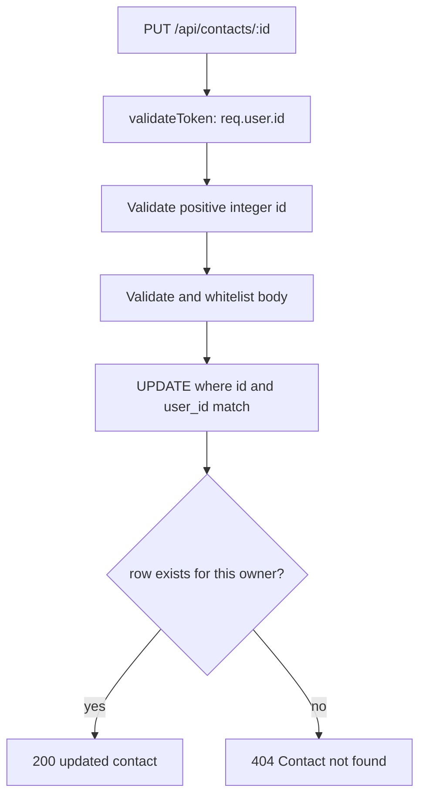

# 13 — Logged-in User: Update Contact

> **Goal:** Implement `PUT /api/contacts/:id` so a user updates only their own contact.
> Validate and whitelist fields, use parameterized SQL, and return safe status codes.

---

## 1. The Three Inputs of an Update

```
PUT /api/contacts/42
Authorization: Bearer <token>     <- WHO is asking: req.user.id
{"phone":"9000000000"}            <- WHAT to change: req.body
                                  <- WHICH row: req.params.id
```



---

## 2. PUT and Partial Updates

HTTP `PUT` normally replaces a resource, while `PATCH` changes selected fields. This
course accepts partial updates in `PUT`; a project may expose the same handler as
`PATCH`. Only `name`, `email`, and `phone` are mutable.

Never pass `req.body` into SQL or derive SQL column names from client keys. Build the
update from an explicit allowlist.

---

## 3. Safe Update Controller

```js
import { pool } from '../config/dbConnection.js';
import { HttpError } from '../utils/HttpError.js';

const EMAIL_RE = /^[^\s@]+@[^\s@]+\.[^\s@]+$/;
const PHONE_RE = /^[0-9+()\-\s]{6,20}$/;

const FIELD_RULES = {
  name: (value) => value.length > 0 && value.length <= 100,
  email: (value) => EMAIL_RE.test(value) && value.length <= 254,
  phone: (value) => PHONE_RE.test(value),
};

export const updateContact = async (req, res) => {
  const id = Number(req.params.id);
  if (!Number.isSafeInteger(id) || id <= 0) {
    throw new HttpError(404, 'Contact not found');
  }

  const body = req.body ?? {};
  const update = {};
  const errors = [];

  for (const [field, isValid] of Object.entries(FIELD_RULES)) {
    if (body[field] === undefined) continue;
    if (typeof body[field] !== 'string') {
      errors.push({ field, message: 'must be a string' });
      continue;
    }

    let value = body[field].trim();
    if (field === 'email') value = value.toLowerCase();
    if (!isValid(value)) errors.push({ field, message: `invalid ${field}` });
    else update[field] = value;
  }

  if (errors.length) throw new HttpError(400, 'Validation failed', errors);
  if (Object.keys(update).length === 0) {
    throw new HttpError(400, 'Provide at least one of: name, email, phone');
  }

  const columns = Object.keys(update);
  const setClause = columns.map((column) => `${column} = ?`).join(', ');
  const values = columns.map((column) => update[column]);
  values.push(id, req.user.id);

  await pool.execute(
    `UPDATE contacts SET ${setClause}
     WHERE id = ? AND user_id = ?`,
    values
  );

  const [rows] = await pool.execute(
    `SELECT id, name, email, phone, created_at AS createdAt,
            updated_at AS updatedAt
     FROM contacts
     WHERE id = ? AND user_id = ?
     LIMIT 1`,
    [id, req.user.id]
  );

  if (rows.length === 0) throw new HttpError(404, 'Contact not found');
  res.status(200).json(rows[0]);
};
```

The column names come only from `FIELD_RULES`; all values are placeholders. Including
`id` and `user_id` in the `UPDATE` enforces ownership atomically.

---

## 4. Why Not Check Ownership First?

This two-step approach is weaker and more revealing:

```js
// ❌ A separate read, then a write without the owner condition
const [rows] = await pool.execute('SELECT * FROM contacts WHERE id = ?', [id]);
if (rows[0].user_id !== req.user.id) throw new HttpError(403, 'Forbidden');
await pool.execute('UPDATE contacts SET phone = ? WHERE id = ?', [phone, id]);
```

Prefer one owner-scoped write:

```sql
UPDATE contacts SET phone = ? WHERE id = ? AND user_id = ?;
```

No other user's row can match this update. The follow-up select uses the same owner
filter and returns 404 if no row belongs to the caller.

---

## 5. Test the Update Endpoint

| # | Request | Token | Expected |
|---|---------|-------|----------|
| 1 | `PUT /contacts/42` `{"phone":"9000000000"}` | Owner | 200; phone changed |
| 2 | `PUT /contacts/42` `{"email":"NEW@X.com"}` | Owner | 200; email stored lowercase |
| 3 | Update another user's contact | Other user | 404; row unchanged |
| 4 | No token | — | 401 |
| 5 | `PUT /contacts/not-an-id` | Owner | 404 |
| 6 | Empty body `{}` | Owner | 400 |
| 7 | `{"email":"bad"}` | Owner | 400 |
| 8 | `{"name":123}` | Owner | 400 |
| 9 | `{"user_id":999,"phone":"9111111111"}` | Owner | 200; phone changes, owner does not |
| 10 | `{"created_at":"1999-01-01"}` | Owner | 400; no allowed fields |

After testing, verify in MySQL:

```sql
SELECT id, user_id, name, email, phone, updated_at
FROM contacts
WHERE id = ?;
```

---

## 6. Status Codes

| Situation | Status |
|-----------|--------|
| Updated successfully | 200 with the updated resource |
| Invalid body or no allowed fields | 400 |
| Missing or invalid token | 401 |
| Invalid ID, missing contact, or not owned | 404 |
| Duplicate value violates a unique constraint | 409 |
| Unexpected database failure | 500 |

---

## 7. Security Notes 🔐

- Whitelist `name`, `email`, and `phone`; never accept `user_id` from the caller.
- Bind SQL values using `pool.execute()`.
- SQL identifiers are built only from the fixed `FIELD_RULES` keys.
- Include both `id` and `user_id` in writes and reads.
- Return 404 for both nonexistent and non-owned rows to avoid information leaks.
- Keep `created_at`, `updated_at`, and `user_id` outside the update allowlist.

---

## 8. Common Mistakes

| Mistake | Symptom | Fix |
|---------|---------|-----|
| `UPDATE ... WHERE id = ?` only | IDOR: any user can update any row | Add `AND user_id = ?` |
| SQL identifier copied from request | SQL injection | Allowlist column names |
| Passing `req.body` as SQL values | Wrong columns or mass assignment | Build a validated field map |
| Ignoring empty updates | Pointless write | Return 400 |
| Returning 404 only after leaking ownership | Reveals another user's record | Use the same owner-scoped filter |
| Assuming `affectedRows === 0` means not found | No-op update can match but not change values | Query the row with owner filter |

---

## 9. Summary

- Validate the ID and allowed body fields.
- Construct SQL with allowlisted column names and parameterized values.
- Enforce ownership in the `UPDATE` and follow-up `SELECT`.
- Keep protected owner and timestamp columns immutable to clients.
