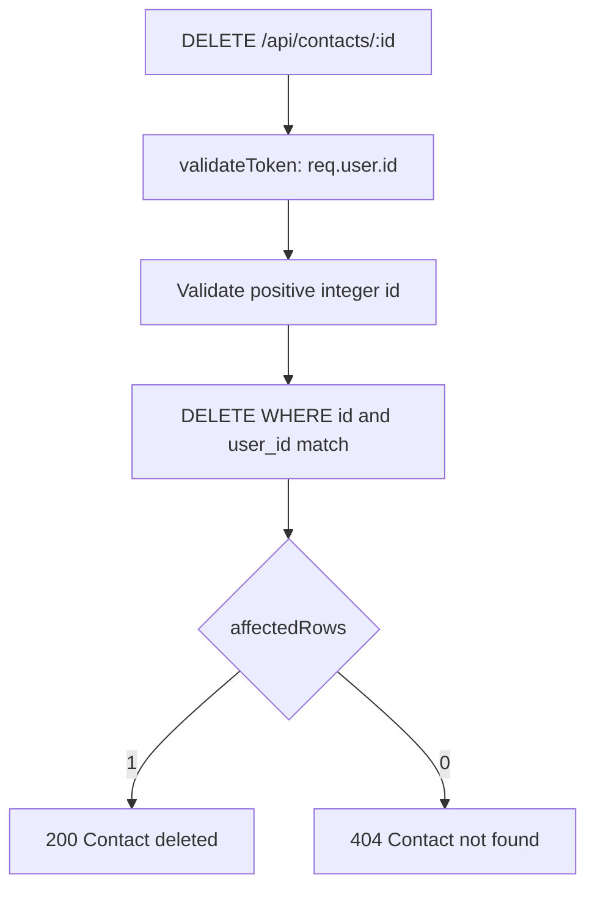
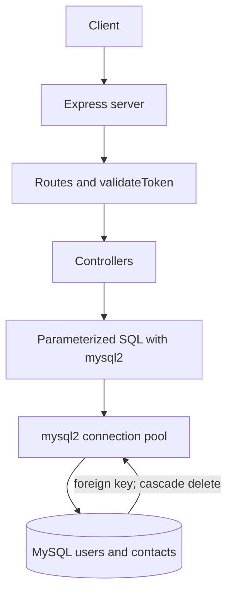

# 14 — Logged-in User: Delete Contact

> **Goal:** Implement `DELETE /api/contacts/:id` with ownership enforced in MySQL, choose
> a response code, understand hard delete and cascading, and review the completed project.

---

## 1. The Flow



Use one owner-scoped statement:

```sql
DELETE FROM contacts WHERE id = ? AND user_id = ?;
```

---

## 2. Implementation

```js
import { pool } from '../config/dbConnection.js';
import { HttpError } from '../utils/HttpError.js';

export const deleteContact = async (req, res) => {
  const id = Number(req.params.id);
  if (!Number.isSafeInteger(id) || id <= 0) {
    throw new HttpError(404, 'Contact not found');
  }

  const [result] = await pool.execute(
    'DELETE FROM contacts WHERE id = ? AND user_id = ?',
    [id, req.user.id]
  );

  if (result.affectedRows === 0) {
    throw new HttpError(404, 'Contact not found');
  }

  res.status(200).json({ message: 'Contact deleted', id });
};
```

`affectedRows` is the number of deleted rows. Since the ID is unique, success deletes one
row; zero rows means it did not exist or did not belong to this user.

---

## 3. Choosing the Response

| Option | Status | Body | Notes |
|--------|--------|------|-------|
| Confirmation message | **200** | `{ message, id }` | Easy for clients to display |
| Return deleted resource | 200 | Deleted contact | Enables UI undo patterns |
| No content | **204** | None | Client must not parse JSON |

The sample controller uses **200**. A repeated request returns 404 because the row has
already been deleted.

For a 204 response:

```js
res.status(204).end();
```

---

## 4. Hard Delete and Soft Delete

| | Hard delete | Soft delete |
|---|-------------|-------------|
| How | Remove the row | Set a `deleted_at` timestamp |
| Recoverable | Only from backups | Yes, until purged |
| Query complexity | Simple | Every read must exclude deleted rows |
| Privacy erasure | Removes row | Requires a later purge policy |

If the product needs soft deletion, add a nullable column:

```sql
ALTER TABLE contacts ADD COLUMN deleted_at TIMESTAMP NULL;
```

Soft-delete only the caller's row:

```js
await pool.execute(
  `UPDATE contacts
   SET deleted_at = CURRENT_TIMESTAMP
   WHERE id = ? AND user_id = ? AND deleted_at IS NULL`,
  [id, req.user.id]
);
```

Every read query must then include `deleted_at IS NULL`. MySQL does not automatically expire rows; purge old soft-deleted rows with a scheduled
job and a retention policy.

---

## 5. Deleting a User's Data

The contact table was defined with:

```sql
FOREIGN KEY (user_id) REFERENCES users(id) ON DELETE CASCADE
```

Deleting a user row therefore deletes the associated contacts automatically:

```js
await pool.execute('DELETE FROM users WHERE id = ?', [req.user.id]);
```

If account deletion also changes other tables, run it in a transaction:

```js
const connection = await pool.getConnection();
try {
  await connection.beginTransaction();
  await connection.execute('DELETE FROM users WHERE id = ?', [req.user.id]);
  await connection.commit();
} catch (err) {
  await connection.rollback();
  throw err;
} finally {
  connection.release();
}
```

The transaction makes the operation all-or-nothing; the foreign key cascade handles the
contacts.

---

## 6. Test the Delete Endpoint

Setup: Asha owns Priya and Kiran; Ravi owns Meera.

| # | Request | Token | Expected |
|---|---------|-------|----------|
| 1 | `DELETE /contacts/KIRAN_ID` | A | 200 deleted |
| 2 | `GET /contacts/KIRAN_ID` | A | 404 |
| 3 | `GET /contacts` | A | Priya only |
| 4 | Delete Kiran again | A | 404 |
| 5 | Delete Meera | A | 404; Meera still exists for Ravi |
| 6 | `GET /contacts` | B | Meera still there |
| 7 | Delete Meera | none | 401 |
| 8 | `DELETE /contacts/abc` | B | 404 |
| 9 | Delete Meera | B | 200 |

Test #5 is crucial: one valid user must not delete another user's data.

---

## 7. Final Project Recap

### Architecture



### Endpoints

| Method | URL | Access | Success |
|--------|-----|--------|---------|
| POST | `/api/users/register` | Public | 201 |
| POST | `/api/users/login` | Public | 200 `{accessToken}` |
| GET | `/api/users/current` | Private | 200 |
| GET | `/api/contacts` | Private | 200 paginated list |
| GET | `/api/contacts/:id` | Private | 200 |
| POST | `/api/contacts` | Private | 201 |
| PUT | `/api/contacts/:id` | Private | 200 |
| DELETE | `/api/contacts/:id` | Private | 200 |

### `.env.example`

```dotenv
PORT=5000
NODE_ENV=development
DB_HOST=127.0.0.1
DB_PORT=3306
DB_NAME=mycontacts
DB_USER=mycontacts_app
DB_PASSWORD=replace-me
ACCESS_TOKEN_SECRET=generate-with-openssl-rand-hex-32
ACCESS_TOKEN_EXPIRES_IN=15m
```

---

## 8. Security Review Checklist 🔐

### Authentication
- [ ] Passwords are hashed with bcrypt and never logged or returned.
- [ ] Login errors are generic; requests are rate-limited.
- [ ] JWT secret is strong, loaded from environment, and differs by environment.
- [ ] Token expiry is short; verification pins the expected algorithm.
- [ ] HTTPS is enforced in production.

### Authorization
- [ ] Every contact route is protected by `validateToken`.
- [ ] Every contact query uses `user_id = req.user.id`.
- [ ] Owner ID never comes from body, params, or query.
- [ ] Cross-user read, update, and delete cases return 404.

### Input handling
- [ ] Request types, lengths, and formats are validated.
- [ ] Create/update statements use explicit column allowlists.
- [ ] All values use `pool.execute()` placeholders.
- [ ] Sort columns are allowlisted; pagination is capped.
- [ ] Request body size is limited.

### Data and infrastructure
- [ ] MySQL is not publicly exposed; application credentials are least-privilege.
- [ ] `users.email` is unique; `contacts.user_id` has a foreign key and index.
- [ ] `.env` is ignored by Git and secrets are stored in a vault/platform setting.
- [ ] Production errors hide SQL, stack traces, and internal details.
- [ ] Logs do not contain passwords, tokens, or request-body PII.
- [ ] Backups and restore procedures have been tested.

---

## 9. Summary

- Delete with both `id` and `user_id` in one prepared SQL statement.
- Use `affectedRows` to distinguish a successful delete from a non-matching row.
- MySQL foreign keys can cascade deletion of related contact rows.
- Use transactions for multi-table operations and always release checked-out connections.
- Recheck ownership, parameterization, least privilege, and secrets before deployment.
