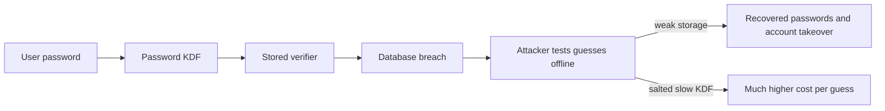
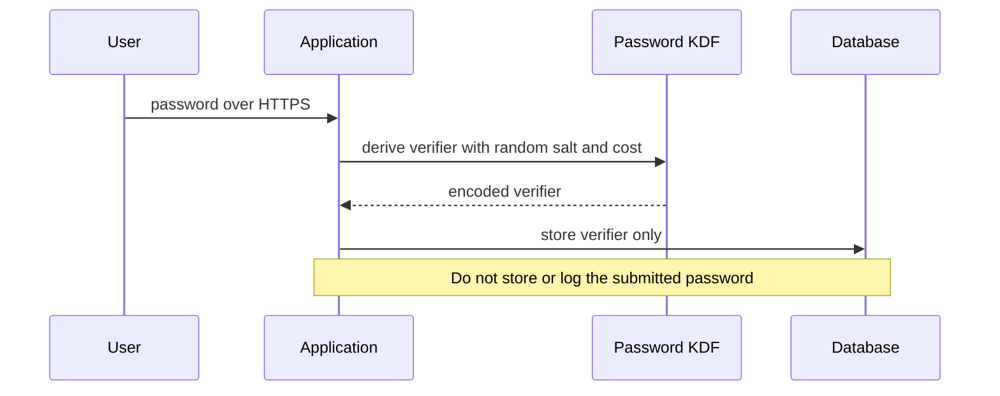

# 01 — Why Passwords Need Protection

> **Goal:** Build a practical threat model for passwords, understand how real-world
> breaches turn stored credentials into account takeovers, and define safe storage goals.

---

## 1. The Password Verifier Is a High-Value Target

A password is a shared secret: a user knows it, and the service needs to decide whether
the user knows the same secret. The service should **not** need to keep the original
password. It needs a verifier that can confirm a future attempt without revealing the
secret itself.

The database is only one threat boundary. Passwords can also leak from application logs,
debug output, analytics, support screenshots, backups, developer machines, or a
compromised server.

---

## 2. A Small Threat Model

| Asset | Threat | Example control |
|-------|--------|-----------------|
| User's password | Database or backup theft | Store a salted, slow password hash, never plaintext |
| Password hash | Offline guessing | Use a password KDF with a calibrated work factor |
| Login endpoint | Automated online guessing | Rate limits, monitoring, risk checks, MFA |
| Account recovery | Social engineering or weak reset links | Short-lived, single-use recovery tokens |
| Password in transit | Network interception | HTTPS; avoid sending credentials to third parties |
| Secret configuration | Pepper or signing key theft | Store separately in a secrets manager; restrict access |

Hashing reduces the impact of a database-only compromise. It does **not** make a
compromised application safe: an attacker who controls the running server may capture
passwords at the moment users submit them.

---

## 3. What Real Breaches Teach Us

Public breach investigations repeatedly show that credential exposure has a long tail:

1. A service stores plaintext or fast unsalted hashes.
2. A database copy is stolen, exposed, or accidentally published.
3. Attackers test likely passwords quickly on the stolen data.
4. Reused credentials are tried on email, banking, shopping, and work services.
5. Recovered credentials are resold or reused in automated credential-stuffing campaigns.

Public reports such as the Verizon Data Breach Investigations Report discuss stolen
credentials and human factors as recurring parts of intrusion chains. Breach stories are
not a substitute for an application's own threat model, but they show why password
storage and login defenses have to work together.

**Never** include real people's credentials, production hashes, or real breach dumps in
course exercises or test fixtures.

---

## 4. Storage Goals

A responsible password verifier should:

- Never store a plaintext password, reversible encryption of a password, or password in
  application logs.
- Use a unique random salt per password.
- Use a password-specific key derivation function (KDF), not a fast general-purpose hash.
- Store the algorithm name and parameters with the verifier so they can be upgraded.
- Verify with a maintained library rather than custom cryptographic code.
- Apply online protections such as throttling and MFA as separate defenses.

---

## 5. What Password Hashing Does Not Do

| Misunderstanding | Reality |
|-----------------|---------|
| "Hashing encrypts the password." | A secure hash/KDF is one-way; there is no decryption key. |
| "A hash means it cannot be guessed." | Guesses can be hashed and compared; weak passwords remain guessable. |
| "Salting stops all attacks." | Salts stop shared precomputation and force per-record work; they do not add password entropy. |
| "MFA means password storage no longer matters." | MFA helps account access, but the password database still needs protection. |
| "A leaked hash is harmless." | Attackers can guess offline without login throttles. |

---

## 6. Exercises

1. Draw a data-flow diagram for a registration request, database, login, logs, and backup.
2. For each row in the threat table, identify one additional control used in your
   organization.
3. Explain why a slow KDF reduces breach impact but cannot repair a compromised web server.
4. Find one public breach postmortem from a reputable organization. Record the affected
   asset, likely threat boundary, and lesson without copying any personal data.

---

## 7. Quick Quiz

1. Does a verifier need to store the original password?
2. What kind of attack becomes possible after attackers steal password hashes?
3. Does MFA replace safe password storage?
4. Why should passwords be excluded from logs?
5. What does an application compromise change about the protection offered by hashing?

Answers

1. No; it only needs to verify a future attempt.
2. Offline guessing, which is not constrained by the service's login rate limit.
3. No. MFA is a separate, valuable defense.
4. Logs are copied, retained, searched, and accessed by more systems and people.
5. A compromised running application may capture plaintext as users submit it.

---

## 8. Summary

- Password verifiers are valuable targets because stolen hashes can be attacked offline.
- Use salted, slow password KDFs and keep plaintext out of databases and logs.
- Add online defenses such as rate limits and MFA; hashing alone is not account security.
- Practise only with synthetic data and hashes you created yourself.

### Next lesson

➡️ **02 — Encoding, Encryption, and Hashing**
Separate three often-confused transformations before choosing how to protect data.
