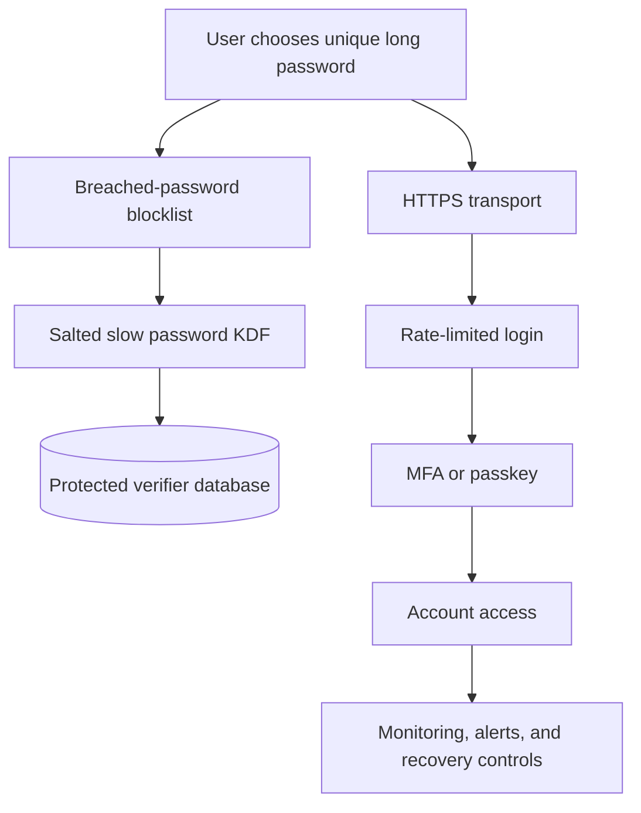

# 09 — Password Policy and Defence in Depth

> **Goal:** Set usable password rules and combine password storage with breached-password
> screening, credential-stuffing defenses, rate limits, MFA, and safe recovery.

---

## 1. Password Policy Should Help Users

Password policy should encourage long, unique secrets that users can manage. NIST
SP 800-63B guidance for single-factor passwords uses a minimum of 15 characters; a
password used only as part of MFA may have a lower minimum, but at least 8. Verifiers
should support long passwords (at least 64 characters maximum) and avoid arbitrary
composition rules. Confirm current organizational and regulatory requirements.

| Policy | Better practice |
|--------|-----------------|
| Minimum length | Use current guidance; favor longer passphrases |
| Maximum length | Support at least 64 characters and document any higher resource limit |
| Character classes | Do not require arbitrary mixtures as a substitute for length |
| Spaces and Unicode | Accept legitimate passphrases; define consistent handling |
| Password managers | Allow paste and autofill |
| Routine expiration | Do not force periodic changes without evidence of compromise or a policy requirement |
| Known-compromised passwords | Block them at creation/change without revealing sensitive lookup data |

Length rules and UI validation must match server-side behavior. Do not silently trim,
truncate, lowercase, or normalize the password.

---

## 2. Breached-Password Checks

At password creation and change, compare the proposed value against a blocklist of
common, expected, and known-compromised passwords. Avoid storing or logging the
submitted password in order to check it.

Options include:

- A locally maintained blocklist for privacy-sensitive environments.
- A vetted breach-check service that uses a privacy-preserving range-query protocol
  (for example, a k-anonymity design); review its current protocol and data handling.

A blocklist check does not prove a password is safe. It blocks known-bad choices and
works best with long unique passwords, rate limits, and MFA.

---

## 3. Credential Stuffing

Credential stuffing uses username/password pairs stolen from one service against another.
The attacker may already know the password, so making the KDF slow does not stop the
initial login attempt.

Use multiple defenses:

- Rate limits by account and by network/device signals, with careful handling of shared
  networks.
- Progressive delays or risk-based challenges rather than account-lockout rules that
  attackers can abuse to deny service.
- Monitoring for unusual login volume, credential reuse patterns, and impossible
  travel/device changes.
- MFA, passkeys, and user notifications for risky events.
- Generic errors and safe account recovery.

---

## 4. Multi-Factor Authentication

MFA requires an additional proof beyond the password. Prefer phishing-resistant
authenticators such as passkeys or security keys where practical. TOTP is stronger than
password-only authentication but can still be phished. SMS has SIM-swap and delivery
risks; treat it as a constrained recovery or fallback method rather than the strongest
option.

Protect enrollment, recovery codes, authenticator reset, and factor removal. A strong
login factor is undermined if account recovery is easier to attack.

---

## 5. Password Reset and Recovery

Reset flows should:

- Use high-entropy, single-use tokens with short expiration.
- Store reset tokens as hashes where practical.
- Return generic responses that do not reveal account existence.
- Invalidate sessions or refresh tokens according to risk and policy.
- Never send the current password back to a user.
- Avoid support procedures that expose secrets or bypass MFA without strong checks.

---

## 6. A Defense-in-Depth View

Each control covers a different failure:

| Control | Helps against |
|---------|---------------|
| Salted slow KDF | Offline guessing after verifier theft |
| Password manager / unique password | Reuse across breached services |
| Breach blocklist | Known weak or exposed choices |
| Rate limits and monitoring | Automated online attempts |
| MFA/passkeys | Stolen password alone |
| Secure recovery | Bypass through reset/enrollment |
| HTTPS and secret redaction | Interception and accidental leakage |

---

## 7. Common Mistakes

| Mistake | Why it hurts | Better approach |
|---------|--------------|-----------------|
| Require `Password1!`-style complexity | Predictable transformations; poor usability | Favor length and block compromised choices |
| Force password changes on a calendar | Users may choose weaker variations | Change on compromise or policy requirement |
| Lock an account after a few failures | Attackers can lock out victims | Use layered throttling and risk controls |
| Treat SMS as phishing-resistant MFA | It is vulnerable to interception and social engineering | Prefer passkeys/security keys; document fallback risks |
| Use a breach API without privacy review | May disclose password-derived data | Review protocol, metadata leakage, retention, and provider |
| Forget account recovery | Attackers bypass the strong login flow | Secure reset and factor recovery equally |

---

## 8. Exercises

1. Review a sample password policy and identify which rules help users versus create
   predictable behavior.
2. Map each defense in the table to one threat it mitigates.
3. Design a credential-stuffing response that avoids both user lockout and unlimited
   attacker attempts.
4. Threat-model password reset and MFA recovery as carefully as login.

---

## 9. Quick Quiz

1. Does a slow KDF stop credential stuffing with already-known passwords?
2. Why permit password-manager paste?
3. What should a reset token be?
4. Which MFA approach is generally more phishing-resistant: SMS or a passkey/security key?

Answers

1. No; it protects stolen verifiers from offline guessing.
2. It supports unique, high-entropy passwords and reduces typing errors.
3. High-entropy, single-use, short-lived, and protected in storage.
4. Passkeys and security keys.

---

## 10. Summary

- Favor long, unique, manager-generated passwords and current standards-based rules.
- Breached-password checks, rate limits, monitoring, and MFA address different threats.
- Protect recovery and enrollment paths as carefully as password verification.

### Next lesson

➡️ **10 — Hands-on Lab: Crack Your Own Toy Hashes**
Use a tiny, local candidate set to see why fast hashes are dangerous—and why password
KDFs are different.
