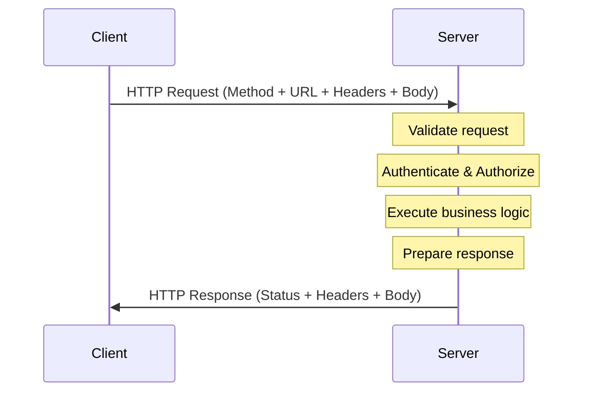

# 01. Introduction to APIs

> **REST API Fundamentals Study Guide**  
> Audience: Absolute Beginners  
> Goal: Build a strong conceptual foundation before learning REST specifically.

---

## Table of Contents

1. What is an API?
2. Why Do We Need APIs?
3. Real-World Analogies for APIs
4. Types of APIs (High-Level Overview)
5. Client-Server Model
6. How APIs Work – Step by Step
7. API vs Website vs Library
8. Common Everyday Examples of APIs
9. Benefits of Using APIs
10. Challenges and Limitations
11. Key Terminology You Must Know
12. Visual Diagrams
13. Practical Thought Exercises
14. Common Beginner Mistakes
15. Key Takeaways
16. Self-Check Questions
17. Summary
18. What’s Next

---

## 1. What is an API?

**API** stands for **Application Programming Interface**.

In simple words:

> An API is a set of rules and definitions that allows one piece of software to talk to another piece of software.

Think of it as a **contract** or a **menu** that tells you:

- What you can ask for
- How you should ask for it
- What you will get back in response

An API does **not** care about the internal implementation. It only defines the interface (the “how to talk”).

### Breaking Down the Acronym

| Letter | Meaning                  | Simple Explanation                                      |
|--------|--------------------------|---------------------------------------------------------|
| A      | Application              | A software program (web app, mobile app, backend service) |
| P      | Programming              | Related to writing code / software                      |
| I      | Interface                | A point of interaction / a way to communicate           |

So, an API is the **interface** that one application exposes so that other applications can programmatically interact with it.

---

## 2. Why Do We Need APIs?

Without APIs, software systems would be isolated islands. They could not share data or functionality easily.

### Main Reasons We Use APIs

1. **Communication between different systems**
   - Mobile app ↔ Backend server
   - Frontend website ↔ Backend
   - One company’s system ↔ Another company’s system

2. **Reusability**
   - Write once, use many times
   - Example: Payment processing logic can be reused by many apps via a payment API

3. **Abstraction / Hiding Complexity**
   - You don’t need to know how the other system works internally
   - You only need to know the rules of the API

4. **Security & Control**
   - The owner of the data decides exactly what can be accessed and how

5. **Scalability & Separation of Concerns**
   - Frontend developers and backend developers can work independently
   - Different teams can evolve their systems at different speeds

6. **Integration with third-party services**
   - Google Maps, Stripe, Weather services, Social login, etc.

---

## 3. Real-World Analogies for APIs

Analogies are extremely helpful for beginners.

### Analogy 1: Restaurant Menu (Most Popular)

- You (the client) sit at a table.
- The menu is the **API**.
- The kitchen is the **server / backend system**.
- You don’t go into the kitchen and cook yourself.
- You look at the menu (API documentation), choose what you want, and place an order (make a request).
- The waiter takes your order to the kitchen and brings back the food (response).

You never need to know *how* the chef prepares the dish — only that if you order “Chicken Biryani”, you will get Chicken Biryani.

### Analogy 2: Electrical Socket / Power Outlet

- The socket is the **API**.
- Any device that follows the correct plug shape can get electricity.
- You don’t care how the power plant generates electricity.
- The interface (shape of the plug + voltage) is standardized.

### Analogy 3: TV Remote Control

- The remote is the **API**.
- Buttons (Power, Volume Up, Channel Change) are the available operations.
- You press a button (send a request).
- The TV responds (changes channel, increases volume).
- You don’t need to understand the internal circuitry of the TV.

### Analogy 4: Library Card Catalog (Older but Useful)

- The catalog tells you what books exist and where they are.
- You request a book using the catalog information.
- The librarian (system) fetches it for you.

---

## 4. Types of APIs (High-Level Overview)

At this stage we only need a gentle overview. We will focus on REST later.

| Type of API          | Description                                      | Common Use Case                     | Protocol / Style      |
|----------------------|--------------------------------------------------|-------------------------------------|-----------------------|
| REST API             | Resource-based, uses HTTP                        | Most modern web & mobile backends   | HTTP                  |
| SOAP API             | Strict XML-based protocol                        | Enterprise / banking (older systems)| HTTP + XML            |
| GraphQL API          | Client specifies exactly what data it needs      | Flexible data fetching              | HTTP                  |
| gRPC                 | High-performance, binary protocol                | Microservices internal communication| HTTP/2 + Protobuf     |
| WebSocket API        | Full-duplex real-time communication              | Chat, live updates, gaming          | WebSocket             |
| Library / SDK API    | Functions you call inside your own code          | Using a JavaScript library          | Language-specific     |

**Important for this course:**  
We will focus almost entirely on **REST APIs** because they are the most widely used style for public and internal web APIs today.

---

## 5. Client-Server Model

Almost every modern API follows the **Client-Server** architecture.

```
┌─────────────┐                      ┌─────────────┐
│             │   Request            │             │
│   Client    │ ───────────────────► │   Server    │
│  (Consumer) │                      │  (Provider) │
│             │ ◄─────────────────── │             │
└─────────────┘   Response           └─────────────┘
```

### Roles

- **Client**: The application that wants data or wants to perform an action.
  - Examples: Mobile app, React website, another backend service, Postman, curl

- **Server**: The application that owns the data or the business logic and exposes an API.

### Key Characteristics

- Client and Server are **independent**.
- They can be written in completely different programming languages.
- They only need to agree on the API contract (URL structure, request format, response format).
- The server can be updated without forcing the client to change (as long as the API contract stays the same).

---

## 6. How APIs Work – Step by Step

Let’s walk through a typical interaction:

1. **Client prepares a request**
   - Decides which endpoint (URL) to call
   - Chooses the HTTP method (GET, POST, etc.)
   - Adds any required headers
   - Adds a body if needed (for POST/PUT/PATCH)

2. **Client sends the request** over the network (usually HTTPS)

3. **Server receives the request**
   - Validates the request
   - Checks authentication / authorization (if required)
   - Performs the business logic (query database, calculate something, etc.)

4. **Server prepares a response**
   - Chooses an appropriate status code (200, 201, 400, 404, 500…)
   - Adds response headers
   - Puts data in the response body (usually JSON)

5. **Server sends the response** back to the client

6. **Client receives and processes the response**
   - Checks the status code
   - Parses the body
   - Updates the UI or continues with the next step

This request-response cycle is the heart of how most APIs work.

---

## 7. API vs Website vs Library

Many beginners confuse these three concepts.

| Aspect              | Website                          | API                                      | Library / SDK                          |
|---------------------|----------------------------------|------------------------------------------|----------------------------------------|
| Who uses it?        | Humans (via browser)             | Software programs                        | Developers (inside their code)         |
| Interaction style   | Click buttons, fill forms        | Programmatic requests                    | Function / method calls                |
| Returns             | HTML pages                       | Structured data (JSON, XML…)             | Values, objects, or side effects       |
| Example             | amazon.com                       | api.amazon.com or AWS APIs               | axios, lodash, requests (Python)       |
| Visibility          | Visible in browser               | Usually not directly visible             | Exists only in code                    |

**Key Insight:**  
A website can use an API behind the scenes.  
A mobile app almost always talks to an API.  
A library is code that runs inside your own application.

---

## 8. Common Everyday Examples of APIs

You already use APIs every day without realizing it:

1. **Weather Apps**
   - Your phone’s weather app calls a weather API to get current temperature and forecast.

2. **Google Maps / Apple Maps**
   - When you search for directions, the app calls mapping APIs.

3. **Login with Google / Facebook / Apple**
   - These are OAuth-based APIs that allow one service to authenticate you using another.

4. **Payment Gateways**
   - When you buy something online, the website calls Stripe, PayPal, or Razorpay APIs.

5. **Social Media Feeds**
   - Instagram, Twitter/X, LinkedIn all expose APIs (and also consume many internal APIs).

6. **Food Delivery Apps**
   - Zomato, Swiggy, Uber Eats continuously call restaurant, location, and payment APIs.

7. **Flight / Hotel Booking**
   - Travel websites aggregate data from many airline and hotel APIs.

---

## 9. Benefits of Using APIs

| Benefit                        | Explanation                                                                 |
|--------------------------------|-----------------------------------------------------------------------------|
| Loose Coupling                 | Client and server can evolve independently                                  |
| Reusability                    | Same backend can serve web, mobile, desktop, and third-party partners       |
| Faster Development             | Teams can work in parallel; frontend doesn’t wait for backend UI            |
| Scalability                    | Server can be scaled independently of clients                               |
| Security Control               | You decide exactly what data and actions are exposed                        |
| Innovation                     | Third parties can build new products on top of your API                     |
| Standardization                | Common patterns (especially REST) make learning and integration easier      |

---

## 10. Challenges and Limitations

APIs are powerful, but they are not magic.

### Common Challenges

- **Network dependency**: If the network is down, the API call fails.
- **Latency**: Every request takes some time (milliseconds to seconds).
- **Versioning**: Changing an API without breaking existing clients is hard.
- **Documentation**: Poor documentation makes APIs painful to use.
- **Security**: Exposed APIs can become attack surfaces if not properly protected.
- **Rate limiting**: Servers often limit how many requests a client can make.
- **Error handling**: Clients must be prepared for many possible failure scenarios.

Understanding these challenges early helps you design and use APIs more thoughtfully.

---

## 11. Key Terminology You Must Know

| Term                | Simple Definition                                                                 |
|---------------------|-----------------------------------------------------------------------------------|
| Client              | The application that makes the request                                            |
| Server              | The application that receives the request and sends a response                    |
| Request             | The message sent by the client                                                    |
| Response            | The message sent back by the server                                               |
| Endpoint            | A specific URL where an API can be accessed                                       |
| Resource            | The “thing” the API is dealing with (user, product, order, etc.)                  |
| Payload / Body      | The actual data sent in a request or response                                     |
| Header              | Metadata sent along with the request or response                                  |
| Status Code         | A number that indicates the result of the request (success, error, etc.)          |
| Authentication      | Proving who you are                                                               |
| Authorization       | Proving what you are allowed to do                                                |
| JSON                | The most common data format used in modern APIs                                   |
| REST                | A popular architectural style for designing APIs (our main focus)                 |

---

## 12. Visual Diagrams

### Diagram 1: Basic Client-Server Communication

```
          Client Side                              Server Side
    ┌───────────────────┐                    ┌───────────────────┐
    │                   │                    │                   │
    │  Mobile App       │                    │  Backend Server   │
    │  Web Frontend     │   HTTP Request     │  (API)            │
    │  Another Service  │ ─────────────────► │                   │
    │                   │                    │  - Validate       │
    │                   │                    │  - Process        │
    │                   │   HTTP Response    │  - Query DB       │
    │                   │ ◄───────────────── │  - Return data    │
    │                   │                    │                   │
    └───────────────────┘                    └───────────────────┘
```

### Diagram 2: API as a Contract

```
                    ┌─────────────────────────────┐
                    │        API Contract         │
                    │  (Documentation + Rules)    │
                    │                             │
                    │  - Available endpoints      │
                    │  - Allowed methods          │
                    │  - Request format           │
                    │  - Response format          │
                    │  - Status codes             │
                    │  - Error formats            │
                    └─────────────────────────────┘
                              ▲
                              │
              ┌───────────────┴───────────────┐
              │                               │
     ┌────────┴────────┐             ┌────────┴────────┐
     │     Client      │             │     Server      │
     │  (must follow   │             │  (must honor    │
     │   the contract) │             │   the contract) │
     └─────────────────┘             └─────────────────┘
```

### Mermaid Diagram (Client-Server Sequence)



---

## 13. Practical Thought Exercises

Try answering these without looking at the answers first:

1. When you open Instagram and see new posts, is your phone talking to a website or an API?
2. Can two completely different programming languages (e.g., Python and JavaScript) communicate via an API?
3. If a company changes its internal database structure, do all the mobile apps that use its API break immediately? Why or why not?
4. Is a JavaScript library like `axios` an API? Is it the same kind of API as a REST API?

**Short Answers (for self-check later):**

1. Mostly an API (the mobile app calls Instagram’s backend APIs).
2. Yes — that is one of the biggest strengths of APIs.
3. No — as long as the public API contract remains the same, internal changes are hidden.
4. `axios` is a **client library** that helps you *call* APIs. The REST API itself is the server-side interface.

---

## 14. Common Beginner Mistakes

| Mistake                                      | Why It’s Wrong                                      | Better Understanding                              |
|----------------------------------------------|-----------------------------------------------------|---------------------------------------------------|
| Thinking API = Website                       | Websites return HTML for humans                     | APIs return structured data for programs          |
| Thinking you need to know the server language| APIs are language-agnostic                          | Only the contract matters                         |
| Ignoring documentation                       | Leads to frustration and incorrect usage            | Documentation is the “menu”                       |
| Assuming every API is REST                   | Many styles exist                                   | REST is popular but not the only option           |
| Forgetting that network can fail             | Leads to fragile applications                       | Always handle errors and timeouts                 |

---

## 15. Key Takeaways

- An API is a **contract** that allows software systems to communicate.
- The most important idea is **separation**: the client does not need to know how the server works internally.
- APIs enable modern software architecture (mobile + web + third-party integrations).
- We will spend the rest of this course learning the most popular style of API: **REST**.
- Good APIs are consistent, well-documented, and predictable.

---

## 16. Self-Check Questions

1. Expand the acronym API and explain each word in one sentence.
2. Give two real-world analogies for an API and explain why they fit.
3. What is the difference between a client and a server in the context of APIs?
4. Why can a Python backend and a React frontend communicate easily via an API?
5. Name three everyday applications that rely heavily on APIs.
6. What is the main advantage of the client-server model?
7. Is Postman a client or a server when you use it to test an API?
8. Why is documentation critical for any API?

---

## 17. Summary

In this first topic we established the foundational idea of what an API is and why it exists.  

You should now be able to:

- Explain APIs to a non-technical friend using an analogy
- Distinguish between a website, an API, and a library
- Understand the basic client-server request-response flow
- Recognize that APIs are everywhere in modern software

This conceptual foundation is essential. Everything that follows (HTTP, REST constraints, resources, status codes, etc.) builds directly on these ideas.

---

## 18. What’s Next

In the next document we will answer the question:

> **What exactly is REST and why did it become the dominant style for web APIs?**

We will keep the same beginner-friendly approach and introduce the core ideas of REST without overwhelming you with advanced theory.

---

**End of Topic 01 – Introduction to APIs**

*Total conceptual coverage: API definition, purpose, analogies, client-server model, benefits, challenges, terminology, and practical thinking exercises.*

---

### Extra Practice (Optional)

Write a short paragraph (5–7 sentences) explaining what an API is, using the restaurant menu analogy, aimed at a complete beginner.

---

**Version**: 1.0  
**Course**: REST API Fundamentals  
**For**: Absolute Beginners
