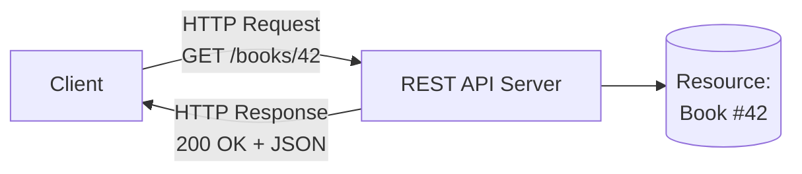

# 02. What is REST?

> **REST API Fundamentals Study Guide**  
> Audience: Absolute Beginners  
> Goal: Understand the core idea of REST before diving into technical details.

---

## Table of Contents

1. Introduction – Why REST Matters
2. The Origin of REST
3. Simple Definition of REST
4. REST is an Architectural Style (Not a Protocol or Standard)
5. The Core Idea: Resources
6. Everything is a Resource
7. Uniform Interface – The Most Important Constraint
8. REST vs SOAP (High-Level Comparison)
9. Why REST Became So Popular
10. What REST is NOT
11. Key Characteristics of a RESTful System
12. Visual Diagrams
13. Real-World REST Examples
14. Common Misconceptions
15. Key Takeaways
16. Self-Check Questions
17. Summary
18. What’s Next

---

## 1. Introduction – Why REST Matters

When people say “API” today, they usually mean a **REST API**.

REST is the dominant architectural style for designing web APIs.  
Almost every modern public API (GitHub, Twitter/X, Stripe, Google, AWS, etc.) follows REST principles to a large extent.

Understanding REST is essential because:

- It gives you a mental model for how good APIs should be designed
- It helps you understand why certain URL structures and HTTP methods are used
- It makes learning any new REST API much faster

This topic focuses on the **ideas** behind REST.  
We will cover the formal constraints in the next document.

---

## 2. The Origin of REST

REST was defined by **Roy Fielding** in his doctoral dissertation in the year 2000.

Full title of the dissertation:

> “Architectural Styles and the Design of Network-based Software Architectures”

Roy Fielding was also one of the main authors of the HTTP specification.  
He looked at how the World Wide Web worked successfully and extracted the architectural principles that made it scalable and flexible.

He named this architectural style **REST** — Representational State Transfer.

---

## 3. Simple Definition of REST

**REST** stands for **Representational State Transfer**.

Let’s break it down in beginner-friendly language:

| Word              | Meaning in REST Context                                      |
|-------------------|--------------------------------------------------------------|
| Representational  | We transfer a *representation* of a resource (usually JSON)  |
| State             | The current data / condition of that resource                |
| Transfer          | Moving that representation between client and server         |

**One-sentence definition:**

> REST is an architectural style for designing networked applications in which clients and servers exchange representations of resources using a uniform interface (usually HTTP).

---

## 4. REST is an Architectural Style (Not a Protocol or Standard)

This is one of the most important points for beginners:

| Concept            | Is REST this? | Explanation                                      |
|--------------------|---------------|--------------------------------------------------|
| Protocol           | No            | HTTP is the protocol. REST uses HTTP.            |
| Standard / Specification | No     | There is no official REST standard body.         |
| Architectural Style| Yes           | It is a set of design constraints and principles.|
| Framework          | No            | You can implement REST in any language.          |
| Library            | No            | REST is a way of designing, not a library.       |

Because REST is only an architectural style, different APIs can be “more RESTful” or “less RESTful”.  
There is a spectrum, not a strict yes/no.

---

## 5. The Core Idea: Resources

The single most important concept in REST is the **Resource**.

A **resource** is any information or “thing” that can be named and referenced.

Examples of resources:

- A user
- A product
- An order
- A blog post
- A list of comments
- A file
- A weather report for a city
- Even a calculation result (less common)

In REST we model our API around these resources instead of around actions or functions.

---

## 6. Everything is a Resource

In a well-designed REST API, almost everything is treated as a resource that has:

1. A unique identifier (usually a URL / URI)
2. One or more representations (JSON, XML, etc.)
3. A standard way to interact with it (using HTTP methods)

### Example – Online Bookstore

| Resource              | Example URI                          |
|-----------------------|--------------------------------------|
| All books             | `/books`                             |
| A specific book       | `/books/42`                          |
| Reviews of a book     | `/books/42/reviews`                  |
| A specific review     | `/books/42/reviews/7`                |
| Authors               | `/authors`                           |
| A specific author     | `/authors/15`                        |
| Books by an author    | `/authors/15/books`                  |

Notice how the URLs are nouns (resources), not verbs (actions).

---

## 7. Uniform Interface – The Most Important Constraint

REST emphasizes a **uniform interface** between client and server.

This means:

- All resources are accessed in a consistent way
- We use the same set of HTTP methods for different resources
- The structure of requests and responses follows predictable patterns

Because of the uniform interface:

- Clients can interact with many different resources without learning a new set of rules each time
- The system becomes simpler and more scalable

We will explore the six formal REST constraints in the next topic.  
For now, remember that “uniform interface” is the heart of REST.

---

## 8. REST vs SOAP (High-Level Comparison)

Many older enterprise systems use SOAP.  
Here is a simple comparison for beginners:

| Aspect                | REST                                      | SOAP                                      |
|-----------------------|-------------------------------------------|-------------------------------------------|
| Style                 | Architectural style                       | Protocol                                  |
| Data Format           | Mostly JSON (sometimes XML)               | XML only                                  |
| Transport             | Usually HTTP                              | HTTP, SMTP, and others                    |
| Complexity            | Lightweight and simple                    | Heavy and complex                         |
| Learning Curve        | Relatively easy                           | Steeper                                   |
| Performance           | Generally faster                          | Slower due to XML verbosity               |
| Flexibility           | High                                      | More rigid                                |
| Browser Support       | Excellent                                 | Limited                                   |
| Modern Popularity     | Extremely high                            | Declining for new projects                |

**Takeaway for beginners:**  
REST won the web because it is simpler, lighter, and works naturally with HTTP and browsers.

---

## 9. Why REST Became So Popular

Several reasons contributed to REST’s success:

1. **It works with the existing web infrastructure**
   - Uses HTTP methods, status codes, and URLs that browsers and servers already understand

2. **Simplicity**
   - Easier to understand and implement than SOAP

3. **Language and platform independence**
   - Any client that can speak HTTP can use a REST API

4. **Scalability**
   - Stateless nature (explained later) makes it easier to scale

5. **JSON revolution**
   - When JSON became popular, it fitted perfectly with REST

6. **Mobile and JavaScript era**
   - Mobile apps and Single Page Applications needed simple HTTP + JSON APIs

7. **Great tooling**
   - Postman, curl, browser DevTools, OpenAPI, etc. all work excellently with REST

---

## 10. What REST is NOT

It is useful to clear up common confusion:

- REST is **not** a protocol
- REST is **not** a standard with a rigid specification
- REST is **not** the same as HTTP (although it almost always uses HTTP)
- REST is **not** only about JSON (JSON is just the most common representation)
- REST is **not** a library or framework
- Having nice URLs does **not** automatically make an API RESTful
- Using HTTP methods does **not** automatically make an API RESTful

An API can use HTTP and JSON and still violate important REST principles.

---

## 11. Key Characteristics of a RESTful System

A system that follows REST principles typically has these characteristics:

1. **Resource-oriented** – Everything is modeled as a resource
2. **Uniform interface** – Consistent way of interacting with resources
3. **Stateless communication** – Each request contains all information needed
4. **Client-Server separation** – Clear separation of concerns
5. **Cacheable responses** – Responses can declare themselves cacheable
6. **Layered system** – Client cannot tell if it is talking to the end server or an intermediate layer

We will examine each of these constraints in detail in the next topic.

---

## 12. Visual Diagrams

### Diagram 1: Resource-Centric Thinking

```
Traditional (Action-Oriented)          REST (Resource-Oriented)
─────────────────────────────          ──────────────────────────
getUser(123)                           GET    /users/123
createUser(data)                       POST   /users
updateUser(123, data)                  PUT    /users/123
deleteUser(123)                        DELETE /users/123
getUserOrders(123)                     GET    /users/123/orders
```

### Diagram 2: Representation Transfer

```
┌────────────┐         Representation of          ┌────────────┐
│            │         the Resource               │            │
│   Client   │ ◄───────────────────────────────►  │   Server   │
│            │         (usually JSON)             │            │
└────────────┘                                    └────────────┘
       ▲                                                 │
       │                                                 │
       │              Resource itself                    │
       │         (lives on the server)                   │
       └─────────────────────────────────────────────────┘
```

### Mermaid – High-Level REST Interaction



---

## 13. Real-World REST Examples

Here are simplified examples of real APIs that follow REST principles:

### GitHub API
- `GET /users/octocat` → Get information about a user
- `GET /repos/octocat/Hello-World` → Get a specific repository
- `GET /repos/octocat/Hello-World/issues` → List issues

### JSONPlaceholder (Fake API for learning)
- `GET /posts` → List all posts
- `GET /posts/1` → Get post with id 1
- `POST /posts` → Create a new post
- `PUT /posts/1` → Replace post 1
- `DELETE /posts/1` → Delete post 1

### Stripe API
- `GET /v1/customers` → List customers
- `POST /v1/customers` → Create a customer
- `GET /v1/customers/cus_123` → Retrieve a specific customer

Notice the pattern: nouns in the URL + standard HTTP methods.

---

## 14. Common Misconceptions

| Misconception                                      | Reality                                                                 |
|----------------------------------------------------|-------------------------------------------------------------------------|
| “REST means using JSON”                            | JSON is just a popular representation format                            |
| “Any HTTP API is a REST API”                       | Many HTTP APIs violate REST constraints                                 |
| “REST requires specific URL patterns”              | Good URL design helps, but is not the definition of REST                |
| “REST is only for public APIs”                     | REST is widely used for internal microservices too                      |
| “You must implement all six constraints perfectly” | Most real-world APIs are “RESTful enough” rather than pure REST         |
| “REST is outdated”                                 | REST remains the dominant style for most web and mobile APIs            |

---

## 15. Key Takeaways

- REST is an **architectural style**, not a protocol or standard.
- The central concept is the **Resource**.
- Clients and servers exchange **representations** of resources (usually JSON).
- REST emphasizes a **uniform interface** so that interactions remain consistent.
- REST became popular because it is simple, scalable, and works naturally with HTTP.
- Most modern web APIs are designed with REST principles in mind.

---

## 16. Self-Check Questions

1. What does the acronym REST stand for?
2. Who defined REST and in what year?
3. Is REST a protocol, a standard, or an architectural style?
4. What is the most important concept in REST?
5. Give three examples of resources in an e-commerce system.
6. Why is the uniform interface important?
7. Name two reasons why REST became more popular than SOAP.
8. True or False: Using JSON automatically makes an API RESTful.
9. What is the difference between a resource and its representation?
10. Can an API use HTTP and still not be considered RESTful? Explain.

---

## 17. Summary

In this topic we moved from the general idea of APIs to the specific architectural style called REST.

You should now understand:

- The origin and meaning of REST
- That REST is about resources and representations
- Why REST focuses on a uniform interface
- The high-level differences between REST and older styles like SOAP
- Why REST dominates modern API design

This conceptual understanding prepares you for the more formal discussion of the six REST constraints in the next document.

---

## 18. What’s Next

Next we will study the **six architectural constraints** that define REST according to Roy Fielding.

These constraints explain *why* REST systems are scalable, simple, and evolvable.

---

**End of Topic 02 – What is REST?**

*Focus: Conceptual understanding of REST as an architectural style centered on resources and uniform interface.*

---

### Extra Practice (Optional)

Explain the difference between a resource and its representation using the example of a “Book” in an online bookstore.

---

**Version**: 1.0  
**Course**: REST API Fundamentals  
**For**: Absolute Beginners
