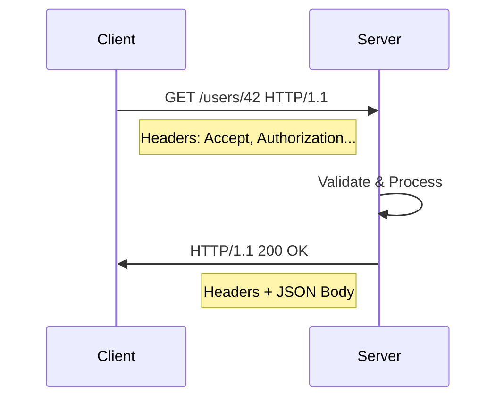

# 03. HTTP Basics (Gentle Introduction)

> **REST API Fundamentals Study Guide**  
> Audience: Absolute Beginners  
> Goal: Build a solid understanding of HTTP — the foundation that REST depends on.

---

## Table of Contents

1. What is HTTP?
2. Why HTTP Matters for REST
3. The Request-Response Cycle
4. Anatomy of an HTTP Request
5. Anatomy of an HTTP Response
6. HTTP Methods (Verbs)
7. Safe Methods vs Unsafe Methods
8. Idempotent Methods
9. Most Important HTTP Status Codes
10. Headers – Metadata of the Conversation
11. Query Parameters vs Path Parameters vs Body
12. HTTPS – The Secure Version
13. Practical Examples with curl and Browser
14. Common Beginner Mistakes with HTTP
15. Visual Diagrams
16. Key Takeaways
17. Self-Check Questions
18. Summary
19. What’s Next

---

## 1. What is HTTP?

**HTTP** stands for **HyperText Transfer Protocol**.

It is the primary protocol used for communication on the World Wide Web.

In simple terms:

> HTTP is the language that browsers, mobile apps, and servers use to talk to each other over the internet.

When you type a URL in your browser or when a mobile app fetches data, HTTP is almost always involved.

---

## 2. Why HTTP Matters for REST

REST was designed to work with the existing web infrastructure.  
Because of that, almost every REST API uses HTTP as its transport protocol.

Understanding HTTP is not optional — it is the foundation:

- REST uses HTTP methods (GET, POST, PUT, DELETE…)
- REST uses HTTP status codes (200, 201, 404, 500…)
- REST uses HTTP headers
- REST resources are identified by HTTP URLs (URIs)

If you understand HTTP well, learning REST becomes much easier.

---

## 3. The Request-Response Cycle

HTTP follows a simple model:

1. The **client** sends an **HTTP Request**
2. The **server** processes it
3. The **server** sends back an **HTTP Response**

```
Client                                Server
  |                                     |
  | -------- HTTP Request ----------->  |
  |                                     |
  |                                     | (process)
  |                                     |
  | <------- HTTP Response -----------  |
  |                                     |
```

This cycle happens for every single API call.

---

## 4. Anatomy of an HTTP Request

An HTTP request has the following main parts:

### 4.1 Request Line (Start Line)

```
METHOD  /path/to/resource  HTTP/1.1
```

Example:

```
GET /users/42 HTTP/1.1
```

### 4.2 Headers

Headers provide metadata about the request.

Common request headers:

| Header            | Purpose                                      | Example Value                     |
|-------------------|----------------------------------------------|-----------------------------------|
| Host              | Domain name of the server                    | api.example.com                   |
| User-Agent        | Information about the client                 | Mozilla/5.0 ...                   |
| Accept            | What response formats the client can handle  | application/json                  |
| Content-Type      | Format of the request body                   | application/json                  |
| Authorization     | Credentials / token                          | Bearer eyJhbGciOi...              |
| Content-Length    | Size of the body in bytes                    | 128                               |

### 4.3 Body (Optional)

The body contains the actual data being sent.  
It is used mainly with POST, PUT, and PATCH.

Example JSON body:

```json
{
  "name": "Alice",
  "email": "alice@example.com"
}
```

### Full Example Request

```
POST /users HTTP/1.1
Host: api.example.com
Content-Type: application/json
Accept: application/json
Authorization: Bearer abc123xyz

{
  "name": "Alice",
  "email": "alice@example.com"
}
```

---

## 5. Anatomy of an HTTP Response

An HTTP response also has three main parts:

### 5.1 Status Line

```
HTTP/1.1 201 Created
```

Contains:
- HTTP version
- Status code
- Reason phrase

### 5.2 Response Headers

| Header             | Purpose                                      | Example Value                  |
|--------------------|----------------------------------------------|--------------------------------|
| Content-Type       | Format of the response body                  | application/json               |
| Content-Length     | Size of the body                             | 256                            |
| Date               | When the response was generated              | Tue, 06 Oct 2026 10:00:00 GMT  |
| Cache-Control      | Caching instructions                         | no-cache                       |
| Location           | Used with 201 to show the new resource URL   | /users/42                      |

### 5.3 Response Body

Usually JSON in modern APIs:

```json
{
  "id": 42,
  "name": "Alice",
  "email": "alice@example.com",
  "createdAt": "2026-10-06T10:00:00Z"
}
```

### Full Example Response

```
HTTP/1.1 201 Created
Content-Type: application/json
Location: /users/42
Content-Length: 98

{
  "id": 42,
  "name": "Alice",
  "email": "alice@example.com",
  "createdAt": "2026-10-06T10:00:00Z"
}
```

---

## 6. HTTP Methods (Verbs)

HTTP defines several methods. The most important ones for REST are:

| Method  | Purpose                              | Has Body? | Typical Use in REST          |
|---------|--------------------------------------|-----------|------------------------------|
| GET     | Retrieve a resource                  | No        | Read data                    |
| POST    | Create a new resource / submit data  | Yes       | Create                       |
| PUT     | Replace an existing resource         | Yes       | Full update                  |
| PATCH   | Partially update a resource          | Yes       | Partial update               |
| DELETE  | Remove a resource                    | Optional  | Delete                       |
| HEAD    | Same as GET but only returns headers | No        | Check if resource exists     |
| OPTIONS | Describe communication options       | No        | CORS preflight               |

We will map these methods to CRUD operations in a later topic.

---

## 7. Safe Methods vs Unsafe Methods

**Safe methods** do not change the state of the server.

| Method  | Safe? | Explanation                              |
|---------|-------|------------------------------------------|
| GET     | Yes   | Only reads data                          |
| HEAD    | Yes   | Only reads headers                       |
| OPTIONS | Yes   | Only asks for information                |
| POST    | No    | Creates or changes something             |
| PUT     | No    | Replaces a resource                      |
| PATCH   | No    | Modifies a resource                      |
| DELETE  | No    | Removes a resource                       |

Safe methods can be called any number of times without side effects (in theory).

---

## 8. Idempotent Methods

An **idempotent** method produces the same result no matter how many times it is called (after the first successful call).

| Method  | Idempotent? | Explanation                                      |
|---------|-------------|--------------------------------------------------|
| GET     | Yes         | Reading the same resource repeatedly is fine     |
| PUT     | Yes         | Replacing with the same data multiple times is fine |
| DELETE  | Yes         | Deleting an already deleted resource stays deleted |
| HEAD    | Yes         | Same as GET                                      |
| OPTIONS | Yes         | Same as GET                                      |
| POST    | No          | Each call may create a new resource              |
| PATCH   | Usually No  | Depends on the operation                         |

Idempotency is very important for reliability (retries, network failures, etc.).

---

## 9. Most Important HTTP Status Codes

Status codes are grouped into five classes:

| Range   | Class               | Meaning                          |
|---------|---------------------|----------------------------------|
| 1xx     | Informational       | Request received, continuing     |
| 2xx     | Success             | Request succeeded                |
| 3xx     | Redirection         | Further action needed            |
| 4xx     | Client Error        | Client made a mistake            |
| 5xx     | Server Error        | Server failed                    |

### Most Common Status Codes for Beginners

| Code | Name                  | When to Use                                      |
|------|-----------------------|--------------------------------------------------|
| 200  | OK                    | Successful GET, PUT, PATCH                       |
| 201  | Created               | Successful POST that created a resource          |
| 204  | No Content            | Successful DELETE or action with no body         |
| 400  | Bad Request           | Invalid data sent by client                      |
| 401  | Unauthorized          | Authentication required or failed                |
| 403  | Forbidden             | Authenticated but not allowed                    |
| 404  | Not Found             | Resource does not exist                          |
| 405  | Method Not Allowed    | HTTP method not supported for this resource      |
| 409  | Conflict              | Request conflicts with current state             |
| 422  | Unprocessable Entity  | Validation errors                                |
| 429  | Too Many Requests     | Rate limit exceeded                              |
| 500  | Internal Server Error | Unexpected server failure                        |
| 503  | Service Unavailable   | Server temporarily unavailable                   |

---

## 10. Headers – Metadata of the Conversation

Headers are key-value pairs that provide additional information.

### Important Request Headers

- `Accept`: What format the client prefers (`application/json`)
- `Content-Type`: Format of the body the client is sending
- `Authorization`: Credentials or token
- `User-Agent`: Identifies the client
- `Cache-Control`: Caching preferences

### Important Response Headers

- `Content-Type`: Format of the response body
- `Location`: URL of a newly created resource (with 201)
- `Cache-Control`: How the response can be cached
- `ETag`: Version identifier for caching and concurrency
- `WWW-Authenticate`: Authentication challenge (with 401)

---

## 11. Query Parameters vs Path Parameters vs Body

There are three common ways to send data to the server:

### Path Parameters
Part of the URL path. Used to identify a specific resource.

```
GET /users/42
         ^^
         path parameter (user id = 42)
```

### Query Parameters
Appear after `?` in the URL. Used for filtering, sorting, pagination.

```
GET /users?role=admin&page=2&limit=20
          ^^^^^^^^^^^^^^^^^^^^^^^^^^^
          query parameters
```

### Request Body
Used for sending complex data (usually with POST, PUT, PATCH).

```json
{
  "name": "Alice",
  "email": "alice@example.com"
}
```

**Rule of thumb for beginners:**
- Use path parameters for resource identity
- Use query parameters for filtering / options
- Use body for the actual data being created or updated

---

## 12. HTTPS – The Secure Version

**HTTPS** = HTTP + TLS/SSL encryption.

- All modern APIs should use HTTPS
- Data is encrypted in transit
- Protects against eavesdropping and man-in-the-middle attacks
- Browsers and mobile platforms increasingly require HTTPS

In URLs you will see:

```
https://api.example.com/users
```

instead of

```
http://api.example.com/users
```

---

## 13. Practical Examples with curl and Browser

### Using curl (command line)

```bash
# Simple GET
curl https://jsonplaceholder.typicode.com/posts/1

# GET with headers
curl -H "Accept: application/json" https://jsonplaceholder.typicode.com/posts/1

# POST with JSON body
curl -X POST https://jsonplaceholder.typicode.com/posts \
  -H "Content-Type: application/json" \
  -d '{"title":"foo","body":"bar","userId":1}'
```

### Using Browser

1. Open Chrome / Firefox
2. Go to any website
3. Press F12 → Network tab
4. Refresh the page
5. Click any request to inspect headers, payload, and response

This is one of the best ways to learn HTTP in practice.

---

## 14. Common Beginner Mistakes with HTTP

| Mistake                                      | Why It’s Problematic                          | Better Approach                              |
|----------------------------------------------|-----------------------------------------------|----------------------------------------------|
| Using GET to change data                     | Violates safe method principles               | Use POST / PUT / PATCH / DELETE              |
| Ignoring status codes                        | Cannot distinguish success from failure       | Always check status code first               |
| Putting sensitive data in query parameters   | May be logged or cached                       | Use body or headers                          |
| Forgetting Content-Type header               | Server may not parse the body correctly       | Always send Content-Type with body           |
| Treating all 4xx the same                    | Different client errors need different handling | Handle 400, 401, 403, 404 differently     |
| Assuming HTTP is enough for security         | Data is sent in plain text                    | Always use HTTPS                             |

---

## 15. Visual Diagrams

### Full Request-Response Flow

```
┌──────────────────┐                         ┌──────────────────┐
│     Client       │                         │     Server       │
│                  │                         │                  │
│ 1. Build Request │                         │                  │
│    - Method      │                         │                  │
│    - URL         │                         │                  │
│    - Headers     │                         │                  │
│    - Body        │                         │                  │
│                  │                         │                  │
│ 2. Send Request  │ ────── HTTP Request ───►│ 3. Receive       │
│                  │                         │ 4. Process       │
│                  │                         │ 5. Build Response│
│                  │                         │    - Status      │
│                  │                         │    - Headers     │
│                  │                         │    - Body        │
│ 7. Process       │ ◄───── HTTP Response ───│ 6. Send Response │
│    Response      │                         │                  │
└──────────────────┘                         └──────────────────┘
```

### Mermaid Sequence Diagram



---

## 16. Key Takeaways

- HTTP is the protocol that REST APIs are built on.
- Every interaction is a request followed by a response.
- Methods tell the server **what action** to perform.
- Status codes tell the client **what happened**.
- Headers carry metadata; the body carries the main data.
- Safe and idempotent properties are important for reliability.
- Always prefer HTTPS in production.

---

## 17. Self-Check Questions

1. What does HTTP stand for?
2. Name the three main parts of an HTTP request.
3. Which HTTP methods are considered safe?
4. Which HTTP methods are idempotent?
5. What is the difference between a 401 and a 403 status code?
6. When should you use a query parameter vs a path parameter?
7. Why should modern APIs use HTTPS instead of HTTP?
8. What header tells the server the format of the request body?
9. What status code is typically returned when a new resource is successfully created?
10. Is POST idempotent? Why or why not?

---

## 18. Summary

HTTP is the foundation upon which REST is built.  

You should now be comfortable with:

- The request-response model
- The structure of requests and responses
- The main HTTP methods and their properties
- The most important status codes
- The difference between path parameters, query parameters, and body
- The importance of headers and HTTPS

This knowledge will make the rest of the REST topics much easier to understand.

---

## 19. What’s Next

In the next topic we will study the **six formal architectural constraints** that define REST according to Roy Fielding.

These constraints explain the deeper design goals behind RESTful systems.

---

**End of Topic 03 – HTTP Basics**

*Focus: Practical understanding of HTTP as the transport and semantic foundation for REST APIs.*

---

**Version**: 1.0  
**Course**: REST API Fundamentals  
**For**: Absolute Beginners
