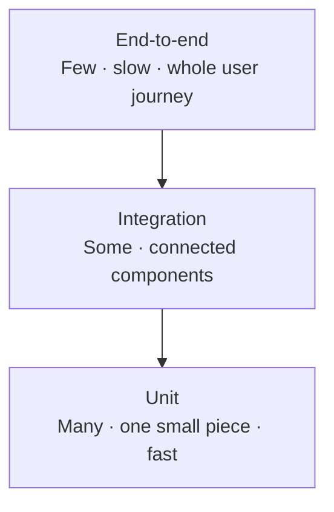

# Unit Test Foundations

## What is a unit test?

A unit test is a small, automatic check that verifies one small piece of code—usually a function or method—does what it is supposed to do.

Think of a car factory. Before the whole car is assembled, workers check the brakes and engine separately. A unit test does the same for code: it checks one small part on its own, before relying on the rest of the system.

A focused unit test does not need a real database, website, or network connection. It runs the code, checks the result, and reports a clear pass or fail.

## Unit, integration, and end-to-end tests

These test levels answer different questions. A healthy test suite uses all three, with more fast unit tests and fewer broad, slower checks.



| Test level | What it checks | Example question |
| --- | --- | --- |
| Unit | One small function or method in isolation | Does an empty cart total zero? |
| Integration | Several real parts working together | Can the service save and read an order? |
| End-to-end | A complete workflow from a user's point of view | Can a customer place an order successfully? |

## A tiny example

This language-neutral pseudocode checks one behavior without a cart UI, database, or network call:

```text
test "empty cart returns zero":
    actual = calculateTotal([])
    assert actual equals 0
```

The test gives one input, runs one unit, and checks one expected result. Real test syntax differs between languages and frameworks.

## Keep the idea, change the tool

Unit testing is not tied to one programming language. The same ideas apply in JavaScript, Python, Java, C#, and other languages. Each ecosystem has its own test tools—for example, Jest or Mocha are common choices in Node.js.

> **Remember:** a unit test asks whether one small piece works on its own. Integration tests ask whether pieces work together. End-to-end tests ask whether the complete experience works for a user.

## Learning check

Imagine a price-calculation function that receives a list of items. Which level would you choose to check that an empty list produces a total of zero? What dependency would you avoid bringing into that test?
