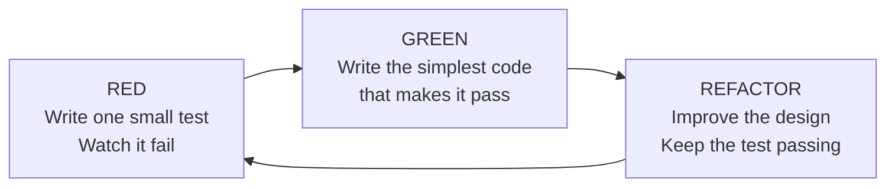

# Red, Green, Refactor

## The TDD cycle

### Red

Write a small test for a behavior that does not exist yet, then run it. It should fail. If it passes immediately, check whether the test is actually exercising the behavior or whether the behavior already exists.

### Green

Write the simplest, quickest code that makes that test pass. It may be rough; the goal of this step is a small, passing behavior.

### Refactor

Clean up duplication and make the code clearer while keeping the passing test as protection. Run the test again after the change.

Then repeat with the next small behavior.

## A login example

Imagine adding a login feature in small steps:

1. Start with “an empty password is rejected.” Write the failing test.
2. Add only enough logic to reject an empty password.
3. Refactor the logic so it is clear and not duplicated.
4. Add a new test for a wrong password, then repeat the cycle.

Each cycle handles one rule. You do not try to build the entire login system in a single test. By the end, the smaller checks protect the combined behavior.

## Where the design work happens

The Green step is not the finish line. Much of the design thinking happens during Refactor: remove duplication, clarify names, and make responsibilities easier to test. Run the tests again to confirm that the behavior remains intact.
